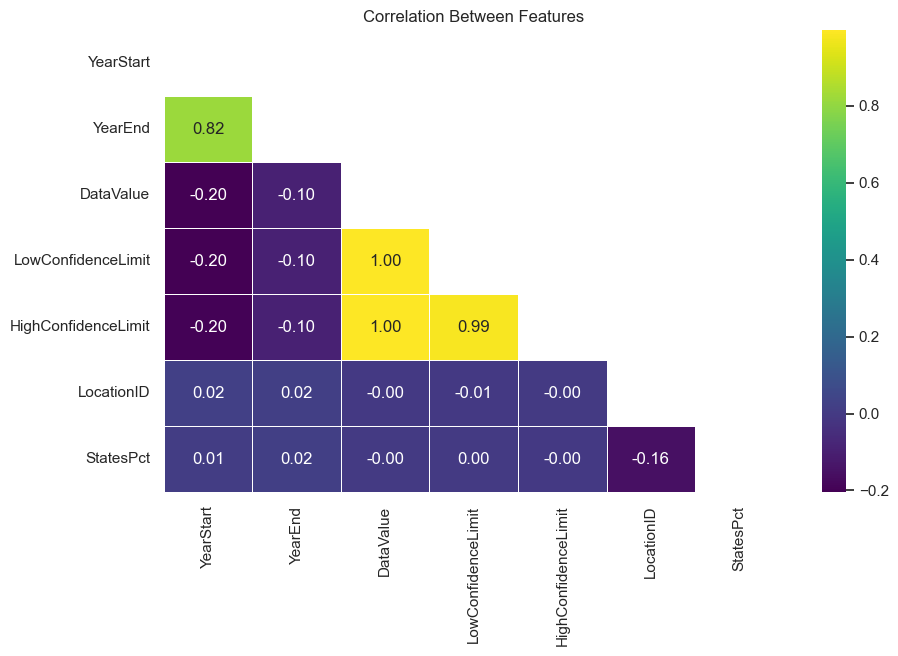

# Data Science Process
There are seven main steps in the data science process. The specific steps that you take will vary depending on the specific problem that you are trying to solve. However, the general process will be the same.
1. Problem framing: This is the first and most important step in the data science process. It involves understanding the research question that you are trying to solve and defining the specific questions that you want to answer with data.
2. Data Collection: Once you have defined your problem, you need to acquire the data that you need to answer your questions. This can involve collecting data from a variety of sources, such as surveys, databases, and social media.
3. Data Cleaning: Once you have acquired your data, you need to prepare it for analysis. This involves cleaning the data, removing errors and outliers, and formatting it in a way that is easy to work with.
4. Data Exploration: This step involves exploring your data to get a better understanding of it. This includes looking at summary statistics, creating visualizations, and asking questions about the data.
5. Modeling: This step involves building models to predict or explain the data. There are many different types of models that you can use, such as linear regression, logistic regression, and decision trees.
6. Evaluation: Once you have built your models, you need to evaluate them to see how well they perform. This involves using metrics such as accuracy, precision, and recall to measure the performance of your models.
7. Deployment: Once you have found a model that performs well, you need to deploy it so that it can be used to make predictions or decisions. This can involve creating a web application, a mobile app, or a dashboard.


## Developing a Research Question

Chronic diseases defined by the Center for Disease Control and Prevention (CDC) are conditions that last 1 year or longer and require ongoing medical attention.  Asthma and chronic obstructive pulmonary disease (COPD) are two of the chronic disease indicators.  There is no cure for either chronic disease.  Some of the highest cases of asthma and COPD are among Black Americans.  Does states with a high percentage of Black/African American population have higher crude prevalence rates of asthma and COPD?


# Problem Statement
**Examining the correlation between the crude prevelance levels of asthma and COPD in states where there is a high percentage of Black/African Americans living.**


## Data Definition
The data should be described with a short synopsis that includes the source, the recency, and the location of the data when permitted.

* **United States Chronic Disease Indicators.** <br>
Last Updated: March 9, 2024 <br>
https://catalog.data.gov/dataset/u-s-chronic-disease-indicators<br>
CDC's Division of Population Health provides a cross-cutting set of 115 indicators developed by consensus among CDC, the Council of State and Territorial Epidemiologists, and the National Association of Chronic Disease Directors. These indicators allow states and territories to uniformly define, collect, and report chronic disease data important to public health practice in their area. In addition to providing access to state-specific indicator data, the CDI website is a gateway to additional information and data resources.

* **Race and Ethnicity in the United States: 2010 Census and 2020 Census.** <br>
Page Last Revised - August 18, 2020 <br>
https://www.census.gov/library/visualizations/interactive/race-and-ethnicity-in-the-united-state-2010-and-2020-census.html <br>
This dataset provides race and ethnicity percentages by groups taken from the 2020 United States Census.  Percent is the percent of total population in the selected regions.  Note:  This data does not include Guam. 

* **Guam Historical and Current Data** <br>
Date of Latest Edit: October 3, 2024 <br>
https://en.wikipedia.org/w/index.php?title=Guam&action=info <br>
This dataset provides historical data, current data and demographic data for U.S. territory of Guam.


### Additional Datasets of Interest
* **Air Quality Measures on the National Environmental Health Tracking Network.** <br>
Last Updated: July 20, 2023. <br>
https://catalog.data.gov/dataset/air-quality-measures-on-the-national-environmental-health-tracking-network<br>
This dataset combines the Environmental Protection Agency (EPA) Air Quality System (AQS) database containing data from approximately 4,000 monitoring stations around the country, mainly in urban areas. Data from the AQS is considered the "gold standard" for determining outdoor air pollution. Centers for Disease Control and Prevention (CDC) and EPA have worked together to develop a statistical model (Downscaler) to make modeled predictions available for environmental public health tracking purposes in areas of the country that do not have monitors and to fill in the time gaps when monitors may not be recording data.

* **Global Fire Emissions Database, Version 4.1 (GFEDv4)** <br>
Last Updated: July 27, 2023 <br>
https://catalog.data.gov/dataset/global-fire-emissions-database-version-4-1-gfedv4 <br>
This dataset provides global estimates of monthly burned area, monthly emissions and fractional contributions of different fire types. National Aeronautics and Space Administration (NASA) emissions data are available for carbon (C), dry matter (DM), carbon dioxide (CO2), carbon monoxide (CO), methane (CH4), hydrogen (H2), nitrous oxide (N2O), nitrogen oxides (NOx), non-methane hydrocarbons (NMHC), organic carbon (OC), black carbon (BC), particulate matter less than 2.5 microns (PM2.5), total particulate matter (TPM), and sulfur dioxide (SO2) among others. These data are yearly totals by region, globally, and by fire source for each region.

* **PM2.5 and cardiovascular mortality rate data: Trends modified by county socioeconomic status in 2,132 US counties** <br>
Last Updated: November 12, 2020 <br>
https://catalog.data.gov/dataset/annual-pm2-5-and-cardiovascular-mortality-rate-data-trends-modified-by-county-socioeconomi <br>
U.S. Environmental Protection Agency Data on county socioeconomic status for 2,132 US counties and each county’s average annual cardiovascular mortality rate (CMR) and total PM2.5 concentration for 21 years (1990-2010). County CMR, PM2.5, and socioeconomic data were obtained from the U.S. National Center for Health Statistics, U.S. Environmental Protection Agency’s Community Multiscale Air Quality modeling system, and the U.S. Census, respectively.

* **EPA Region 6 REAP Sustainability Geodatabase** <br>
Last Updated: November 10, 2020 <br>
https://catalog.data.gov/dataset/epa-region-6-reap-sustainability-geodatabase <br>
The Regional Ecological Assessment Protocol (REAP) is a screening level assessment tool created as a way to identify priority ecological resources within the five EPA Region 6 states (Arkansas, Louisiana, New Mexico, Oklahoma, and Texas). The REAP divides eighteen individual measures into three main sub-layers: diversity, rarity, and sustainability. This geodatabase contains the 2 grids (sustain and sustainrank) representing the sustainability layer which describes the state of the environment in terms of stability (sustainble areas are those that can maintain themselves into the future without human management). There are eleven measures that make up the sustainability layer: contiguous land cover, regularity of ecosystem boundary, appropriateness of land cover, waterway obstruction, road density, airport noise, Superfund sites, Resource Conservation and Recovery Act (RCRA) sites, water quality, air quality, and urban/agriculture disturbance.

## Data Collection:

Data collection begins with identifying a reliable and accurate data source and using tools to download the dataset for examination. 

## Examine the dataset

The methodology is to load the data as a CSV from the CDC website, understand the data, check the data types, completeness of data, and create a data dictionary.

### Import libraries


```python
# Import the libraries
import numpy as np                  # Scientific Computing
import pandas as pd                 # Data Analysis
import matplotlib.pyplot as plt     # Plotting
import seaborn as sns               # Statistical Data Visualization

# Let's make sure pandas returns all the rows and columns for the dataframe
pd.set_option('display.max_rows', None)
pd.set_option('display.max_columns', None)


# Library to suppress warnings
import warnings
warnings.filterwarnings('ignore')
```

### Read the dataset


```python
# Read the dataset
path = pd.read_csv('https://data.cdc.gov/api/views/hksd-2xuw/rows.csv?accessType=DOWNLOAD')

# Create the Dataframe
cdc = pd.DataFrame(path)
```

#### Understanding the Dataset
- Checking first elements of the DataFrame with .head( ) method


```python
# Display the first ten rows of the dataframe
# Syntax: DataFrame.head(qty)
cdc.head(10)
```


<div>

<table border="1" class="dataframe">
  <thead>
    <tr style="text-align: right;">
      <th></th>
      <th>YearStart</th>
      <th>YearEnd</th>
      <th>LocationAbbr</th>
      <th>LocationDesc</th>
      <th>DataSource</th>
      <th>Topic</th>
      <th>Question</th>
      <th>Response</th>
      <th>DataValueUnit</th>
      <th>DataValueType</th>
      <th>DataValue</th>
      <th>DataValueAlt</th>
      <th>DataValueFootnoteSymbol</th>
      <th>DataValueFootnote</th>
      <th>LowConfidenceLimit</th>
      <th>HighConfidenceLimit</th>
      <th>StratificationCategory1</th>
      <th>Stratification1</th>
      <th>StratificationCategory2</th>
      <th>Stratification2</th>
      <th>StratificationCategory3</th>
      <th>Stratification3</th>
      <th>Geolocation</th>
      <th>LocationID</th>
      <th>TopicID</th>
      <th>QuestionID</th>
      <th>ResponseID</th>
      <th>DataValueTypeID</th>
      <th>StratificationCategoryID1</th>
      <th>StratificationID1</th>
      <th>StratificationCategoryID2</th>
      <th>StratificationID2</th>
      <th>StratificationCategoryID3</th>
      <th>StratificationID3</th>
    </tr>
  </thead>
  <tbody>
    <tr>
      <th>0</th>
      <td>2015</td>
      <td>2019</td>
      <td>US</td>
      <td>United States</td>
      <td>US Cancer DVT</td>
      <td>Cancer</td>
      <td>Breast cancer mortality among all females, und...</td>
      <td>NaN</td>
      <td>Number</td>
      <td>Number</td>
      <td>3009.0</td>
      <td>3009.0</td>
      <td>NaN</td>
      <td>NaN</td>
      <td>NaN</td>
      <td>NaN</td>
      <td>Race/Ethnicity</td>
      <td>Hispanic</td>
      <td>NaN</td>
      <td>NaN</td>
      <td>NaN</td>
      <td>NaN</td>
      <td>NaN</td>
      <td>59</td>
      <td>CAN</td>
      <td>CAN02</td>
      <td>NaN</td>
      <td>NMBR</td>
      <td>RACE</td>
      <td>HIS</td>
      <td>NaN</td>
      <td>NaN</td>
      <td>NaN</td>
      <td>NaN</td>
    </tr>
    <tr>
      <th>1</th>
      <td>2019</td>
      <td>2019</td>
      <td>GU</td>
      <td>Guam</td>
      <td>BRFSS</td>
      <td>Diabetes</td>
      <td>Diabetes among adults</td>
      <td>NaN</td>
      <td>%</td>
      <td>Crude Prevalence</td>
      <td>19.3</td>
      <td>19.3</td>
      <td>NaN</td>
      <td>NaN</td>
      <td>15.8</td>
      <td>23.5</td>
      <td>Age</td>
      <td>Age 45-64</td>
      <td>NaN</td>
      <td>NaN</td>
      <td>NaN</td>
      <td>NaN</td>
      <td>POINT (144.793731 13.444304)</td>
      <td>66</td>
      <td>DIA</td>
      <td>DIA01</td>
      <td>NaN</td>
      <td>CRDPREV</td>
      <td>AGE</td>
      <td>AGE4564</td>
      <td>NaN</td>
      <td>NaN</td>
      <td>NaN</td>
      <td>NaN</td>
    </tr>
    <tr>
      <th>2</th>
      <td>2019</td>
      <td>2019</td>
      <td>ID</td>
      <td>Idaho</td>
      <td>BRFSS</td>
      <td>Diabetes</td>
      <td>Diabetes among adults</td>
      <td>NaN</td>
      <td>%</td>
      <td>Crude Prevalence</td>
      <td>10.6</td>
      <td>10.6</td>
      <td>NaN</td>
      <td>NaN</td>
      <td>9.1</td>
      <td>12.2</td>
      <td>Sex</td>
      <td>Male</td>
      <td>NaN</td>
      <td>NaN</td>
      <td>NaN</td>
      <td>NaN</td>
      <td>POINT (-114.3637300419997 43.682630005000476)</td>
      <td>16</td>
      <td>DIA</td>
      <td>DIA01</td>
      <td>NaN</td>
      <td>CRDPREV</td>
      <td>SEX</td>
      <td>SEXM</td>
      <td>NaN</td>
      <td>NaN</td>
      <td>NaN</td>
      <td>NaN</td>
    </tr>
    <tr>
      <th>3</th>
      <td>2019</td>
      <td>2019</td>
      <td>MD</td>
      <td>Maryland</td>
      <td>BRFSS</td>
      <td>Mental Health</td>
      <td>Depression among adults</td>
      <td>NaN</td>
      <td>%</td>
      <td>Crude Prevalence</td>
      <td>12.1</td>
      <td>12.1</td>
      <td>NaN</td>
      <td>NaN</td>
      <td>11.0</td>
      <td>13.3</td>
      <td>Sex</td>
      <td>Male</td>
      <td>NaN</td>
      <td>NaN</td>
      <td>NaN</td>
      <td>NaN</td>
      <td>POINT (-76.60926011099963 39.29058096400047)</td>
      <td>24</td>
      <td>MEN</td>
      <td>MEN02</td>
      <td>NaN</td>
      <td>CRDPREV</td>
      <td>SEX</td>
      <td>SEXM</td>
      <td>NaN</td>
      <td>NaN</td>
      <td>NaN</td>
      <td>NaN</td>
    </tr>
    <tr>
      <th>4</th>
      <td>2019</td>
      <td>2019</td>
      <td>MI</td>
      <td>Michigan</td>
      <td>NVSS</td>
      <td>Health Status</td>
      <td>Life expectancy at birth</td>
      <td>NaN</td>
      <td>Years</td>
      <td>Number</td>
      <td>78.0</td>
      <td>78.0</td>
      <td>NaN</td>
      <td>NaN</td>
      <td>77.9</td>
      <td>78.1</td>
      <td>Overall</td>
      <td>Overall</td>
      <td>NaN</td>
      <td>NaN</td>
      <td>NaN</td>
      <td>NaN</td>
      <td>POINT (-84.71439026999968 44.6613195430005)</td>
      <td>26</td>
      <td>HEA</td>
      <td>HEA06</td>
      <td>NaN</td>
      <td>NMBR</td>
      <td>OVERALL</td>
      <td>OVR</td>
      <td>NaN</td>
      <td>NaN</td>
      <td>NaN</td>
      <td>NaN</td>
    </tr>
    <tr>
      <th>5</th>
      <td>2019</td>
      <td>2019</td>
      <td>MN</td>
      <td>Minnesota</td>
      <td>BRFSS</td>
      <td>Asthma</td>
      <td>Current asthma among adults</td>
      <td>NaN</td>
      <td>%</td>
      <td>Crude Prevalence</td>
      <td>8.9</td>
      <td>8.9</td>
      <td>NaN</td>
      <td>NaN</td>
      <td>8.0</td>
      <td>9.8</td>
      <td>Age</td>
      <td>Age 45-64</td>
      <td>NaN</td>
      <td>NaN</td>
      <td>NaN</td>
      <td>NaN</td>
      <td>POINT (-94.79420050299967 46.35564873600049)</td>
      <td>27</td>
      <td>AST</td>
      <td>AST02</td>
      <td>NaN</td>
      <td>CRDPREV</td>
      <td>AGE</td>
      <td>AGE4564</td>
      <td>NaN</td>
      <td>NaN</td>
      <td>NaN</td>
      <td>NaN</td>
    </tr>
    <tr>
      <th>6</th>
      <td>2019</td>
      <td>2019</td>
      <td>MS</td>
      <td>Mississippi</td>
      <td>BRFSS</td>
      <td>Arthritis</td>
      <td>Severe joint pain among adults with arthritis</td>
      <td>NaN</td>
      <td>%</td>
      <td>Crude Prevalence</td>
      <td>49.2</td>
      <td>49.2</td>
      <td>NaN</td>
      <td>NaN</td>
      <td>45.6</td>
      <td>52.9</td>
      <td>Sex</td>
      <td>Female</td>
      <td>NaN</td>
      <td>NaN</td>
      <td>NaN</td>
      <td>NaN</td>
      <td>POINT (-89.53803082499968 32.745510099000455)</td>
      <td>28</td>
      <td>ART</td>
      <td>ART03</td>
      <td>NaN</td>
      <td>CRDPREV</td>
      <td>SEX</td>
      <td>SEXF</td>
      <td>NaN</td>
      <td>NaN</td>
      <td>NaN</td>
      <td>NaN</td>
    </tr>
    <tr>
      <th>7</th>
      <td>2019</td>
      <td>2019</td>
      <td>MO</td>
      <td>Missouri</td>
      <td>BRFSS</td>
      <td>Tobacco</td>
      <td>Current cigarette smoking among adults</td>
      <td>NaN</td>
      <td>%</td>
      <td>Crude Prevalence</td>
      <td>20.6</td>
      <td>20.6</td>
      <td>NaN</td>
      <td>NaN</td>
      <td>18.7</td>
      <td>22.6</td>
      <td>Sex</td>
      <td>Male</td>
      <td>NaN</td>
      <td>NaN</td>
      <td>NaN</td>
      <td>NaN</td>
      <td>POINT (-92.56630005299968 38.635790776000476)</td>
      <td>29</td>
      <td>TOB</td>
      <td>TOB04</td>
      <td>NaN</td>
      <td>CRDPREV</td>
      <td>SEX</td>
      <td>SEXM</td>
      <td>NaN</td>
      <td>NaN</td>
      <td>NaN</td>
      <td>NaN</td>
    </tr>
    <tr>
      <th>8</th>
      <td>2019</td>
      <td>2019</td>
      <td>NE</td>
      <td>Nebraska</td>
      <td>BRFSS</td>
      <td>Diabetes</td>
      <td>Diabetes among adults</td>
      <td>NaN</td>
      <td>%</td>
      <td>Crude Prevalence</td>
      <td>10.9</td>
      <td>10.9</td>
      <td>NaN</td>
      <td>NaN</td>
      <td>10.0</td>
      <td>11.8</td>
      <td>Sex</td>
      <td>Male</td>
      <td>NaN</td>
      <td>NaN</td>
      <td>NaN</td>
      <td>NaN</td>
      <td>POINT (-99.36572062299967 41.6410409880005)</td>
      <td>31</td>
      <td>DIA</td>
      <td>DIA01</td>
      <td>NaN</td>
      <td>CRDPREV</td>
      <td>SEX</td>
      <td>SEXM</td>
      <td>NaN</td>
      <td>NaN</td>
      <td>NaN</td>
      <td>NaN</td>
    </tr>
    <tr>
      <th>9</th>
      <td>2019</td>
      <td>2019</td>
      <td>NE</td>
      <td>Nebraska</td>
      <td>NVSS</td>
      <td>Diabetes</td>
      <td>Diabetes mortality among all people, underlyin...</td>
      <td>NaN</td>
      <td>Number</td>
      <td>Number</td>
      <td>2108.0</td>
      <td>2108.0</td>
      <td>NaN</td>
      <td>NaN</td>
      <td>NaN</td>
      <td>NaN</td>
      <td>Overall</td>
      <td>Overall</td>
      <td>NaN</td>
      <td>NaN</td>
      <td>NaN</td>
      <td>NaN</td>
      <td>POINT (-99.36572062299967 41.6410409880005)</td>
      <td>31</td>
      <td>DIA</td>
      <td>DIA03</td>
      <td>NaN</td>
      <td>NMBR</td>
      <td>OVERALL</td>
      <td>OVR</td>
      <td>NaN</td>
      <td>NaN</td>
      <td>NaN</td>
      <td>NaN</td>
    </tr>
  </tbody>
</table>
</div>


Checking last elements of the DataFrame with .tail() method


```python
# Display the last ten rows of the dataframe
# Syntax: DataFrame.tail(qty)
cdc.tail(10)
```


<div>

<table border="1" class="dataframe">
  <thead>
    <tr style="text-align: right;">
      <th></th>
      <th>YearStart</th>
      <th>YearEnd</th>
      <th>LocationAbbr</th>
      <th>LocationDesc</th>
      <th>DataSource</th>
      <th>Topic</th>
      <th>Question</th>
      <th>Response</th>
      <th>DataValueUnit</th>
      <th>DataValueType</th>
      <th>DataValue</th>
      <th>DataValueAlt</th>
      <th>DataValueFootnoteSymbol</th>
      <th>DataValueFootnote</th>
      <th>LowConfidenceLimit</th>
      <th>HighConfidenceLimit</th>
      <th>StratificationCategory1</th>
      <th>Stratification1</th>
      <th>StratificationCategory2</th>
      <th>Stratification2</th>
      <th>StratificationCategory3</th>
      <th>Stratification3</th>
      <th>Geolocation</th>
      <th>LocationID</th>
      <th>TopicID</th>
      <th>QuestionID</th>
      <th>ResponseID</th>
      <th>DataValueTypeID</th>
      <th>StratificationCategoryID1</th>
      <th>StratificationID1</th>
      <th>StratificationCategoryID2</th>
      <th>StratificationID2</th>
      <th>StratificationCategoryID3</th>
      <th>StratificationID3</th>
    </tr>
  </thead>
  <tbody>
    <tr>
      <th>310470</th>
      <td>2022</td>
      <td>2022</td>
      <td>VI</td>
      <td>Virgin Islands</td>
      <td>BRFSS</td>
      <td>Health Status</td>
      <td>Recent activity limitation among adults</td>
      <td>NaN</td>
      <td>Number</td>
      <td>Age-adjusted Mean</td>
      <td>3.5</td>
      <td>3.5</td>
      <td>NaN</td>
      <td>NaN</td>
      <td>2.4</td>
      <td>4.7</td>
      <td>Overall</td>
      <td>Overall</td>
      <td>NaN</td>
      <td>NaN</td>
      <td>NaN</td>
      <td>NaN</td>
      <td>POINT (-64.896335 18.335765)</td>
      <td>78</td>
      <td>HEA</td>
      <td>HEA04</td>
      <td>NaN</td>
      <td>AGEADJMEAN</td>
      <td>OVERALL</td>
      <td>OVR</td>
      <td>NaN</td>
      <td>NaN</td>
      <td>NaN</td>
      <td>NaN</td>
    </tr>
    <tr>
      <th>310471</th>
      <td>2022</td>
      <td>2022</td>
      <td>WA</td>
      <td>Washington</td>
      <td>BRFSS</td>
      <td>Alcohol</td>
      <td>Binge drinking frequency among adults who bing...</td>
      <td>NaN</td>
      <td>Number</td>
      <td>Crude Median</td>
      <td>1.9</td>
      <td>1.9</td>
      <td>NaN</td>
      <td>NaN</td>
      <td>1.7</td>
      <td>2.6</td>
      <td>Age</td>
      <td>Age &gt;=65</td>
      <td>NaN</td>
      <td>NaN</td>
      <td>NaN</td>
      <td>NaN</td>
      <td>POINT (-120.47001078999972 47.52227862900048)</td>
      <td>53</td>
      <td>ALC</td>
      <td>ALC04</td>
      <td>NaN</td>
      <td>CRDMEDN</td>
      <td>AGE</td>
      <td>AGE65P</td>
      <td>NaN</td>
      <td>NaN</td>
      <td>NaN</td>
      <td>NaN</td>
    </tr>
    <tr>
      <th>310472</th>
      <td>2022</td>
      <td>2022</td>
      <td>UT</td>
      <td>Utah</td>
      <td>BRFSS</td>
      <td>Health Status</td>
      <td>2 or more chronic conditions among adults</td>
      <td>NaN</td>
      <td>%</td>
      <td>Age-adjusted Prevalence</td>
      <td>NaN</td>
      <td>NaN</td>
      <td>****</td>
      <td>Data suppressed; denominator &lt; 50 or relative ...</td>
      <td>NaN</td>
      <td>NaN</td>
      <td>Race/Ethnicity</td>
      <td>Asian, non-Hispanic</td>
      <td>NaN</td>
      <td>NaN</td>
      <td>NaN</td>
      <td>NaN</td>
      <td>POINT (-111.58713063499971 39.360700171000474)</td>
      <td>49</td>
      <td>HEA</td>
      <td>HEA05</td>
      <td>NaN</td>
      <td>AGEADJPREV</td>
      <td>RACE</td>
      <td>ASN</td>
      <td>NaN</td>
      <td>NaN</td>
      <td>NaN</td>
      <td>NaN</td>
    </tr>
    <tr>
      <th>310473</th>
      <td>2022</td>
      <td>2022</td>
      <td>UT</td>
      <td>Utah</td>
      <td>BRFSS</td>
      <td>Social Determinants of Health</td>
      <td>Routine checkup within the past year among adults</td>
      <td>NaN</td>
      <td>%</td>
      <td>Crude Prevalence</td>
      <td>73.5</td>
      <td>73.5</td>
      <td>NaN</td>
      <td>NaN</td>
      <td>59.5</td>
      <td>83.9</td>
      <td>Race/Ethnicity</td>
      <td>Black, non-Hispanic</td>
      <td>NaN</td>
      <td>NaN</td>
      <td>NaN</td>
      <td>NaN</td>
      <td>POINT (-111.58713063499971 39.360700171000474)</td>
      <td>49</td>
      <td>SDOH</td>
      <td>SDH12</td>
      <td>NaN</td>
      <td>CRDPREV</td>
      <td>RACE</td>
      <td>BLK</td>
      <td>NaN</td>
      <td>NaN</td>
      <td>NaN</td>
      <td>NaN</td>
    </tr>
    <tr>
      <th>310474</th>
      <td>2022</td>
      <td>2022</td>
      <td>VT</td>
      <td>Vermont</td>
      <td>BRFSS</td>
      <td>Immunization</td>
      <td>Influenza vaccination among adults</td>
      <td>NaN</td>
      <td>%</td>
      <td>Age-adjusted Prevalence</td>
      <td>49.4</td>
      <td>49.4</td>
      <td>NaN</td>
      <td>NaN</td>
      <td>36.2</td>
      <td>62.6</td>
      <td>Race/Ethnicity</td>
      <td>American Indian or Alaska Native, non-Hispanic</td>
      <td>NaN</td>
      <td>NaN</td>
      <td>NaN</td>
      <td>NaN</td>
      <td>POINT (-72.51764079099962 43.62538123900049)</td>
      <td>50</td>
      <td>IMM</td>
      <td>IMM01</td>
      <td>NaN</td>
      <td>AGEADJPREV</td>
      <td>RACE</td>
      <td>AIAN</td>
      <td>NaN</td>
      <td>NaN</td>
      <td>NaN</td>
      <td>NaN</td>
    </tr>
    <tr>
      <th>310475</th>
      <td>2022</td>
      <td>2022</td>
      <td>VA</td>
      <td>Virginia</td>
      <td>BRFSS</td>
      <td>Mental Health</td>
      <td>Frequent mental distress among adults</td>
      <td>NaN</td>
      <td>%</td>
      <td>Age-adjusted Prevalence</td>
      <td>17.1</td>
      <td>17.1</td>
      <td>NaN</td>
      <td>NaN</td>
      <td>16.0</td>
      <td>18.3</td>
      <td>Overall</td>
      <td>Overall</td>
      <td>NaN</td>
      <td>NaN</td>
      <td>NaN</td>
      <td>NaN</td>
      <td>POINT (-78.45789046299967 37.54268067400045)</td>
      <td>51</td>
      <td>MEN</td>
      <td>MEN05</td>
      <td>NaN</td>
      <td>AGEADJPREV</td>
      <td>OVERALL</td>
      <td>OVR</td>
      <td>NaN</td>
      <td>NaN</td>
      <td>NaN</td>
      <td>NaN</td>
    </tr>
    <tr>
      <th>310476</th>
      <td>2022</td>
      <td>2022</td>
      <td>WA</td>
      <td>Washington</td>
      <td>BRFSS</td>
      <td>Social Determinants of Health</td>
      <td>Lack of health insurance among adults aged 18-...</td>
      <td>NaN</td>
      <td>%</td>
      <td>Age-adjusted Prevalence</td>
      <td>30.4</td>
      <td>30.4</td>
      <td>NaN</td>
      <td>NaN</td>
      <td>27.8</td>
      <td>33.1</td>
      <td>Race/Ethnicity</td>
      <td>Hispanic</td>
      <td>NaN</td>
      <td>NaN</td>
      <td>NaN</td>
      <td>NaN</td>
      <td>POINT (-120.47001078999972 47.52227862900048)</td>
      <td>53</td>
      <td>SDOH</td>
      <td>SDH09</td>
      <td>NaN</td>
      <td>AGEADJPREV</td>
      <td>RACE</td>
      <td>HIS</td>
      <td>NaN</td>
      <td>NaN</td>
      <td>NaN</td>
      <td>NaN</td>
    </tr>
    <tr>
      <th>310477</th>
      <td>2022</td>
      <td>2022</td>
      <td>UT</td>
      <td>Utah</td>
      <td>BRFSS</td>
      <td>Health Status</td>
      <td>Frequent physical distress among adults</td>
      <td>NaN</td>
      <td>%</td>
      <td>Age-adjusted Prevalence</td>
      <td>NaN</td>
      <td>NaN</td>
      <td>****</td>
      <td>Data suppressed; denominator &lt; 50 or relative ...</td>
      <td>NaN</td>
      <td>NaN</td>
      <td>Race/Ethnicity</td>
      <td>Hawaiian or Pacific Islander, non-Hispanic</td>
      <td>NaN</td>
      <td>NaN</td>
      <td>NaN</td>
      <td>NaN</td>
      <td>POINT (-111.58713063499971 39.360700171000474)</td>
      <td>49</td>
      <td>HEA</td>
      <td>HEA03</td>
      <td>NaN</td>
      <td>AGEADJPREV</td>
      <td>RACE</td>
      <td>HAPI</td>
      <td>NaN</td>
      <td>NaN</td>
      <td>NaN</td>
      <td>NaN</td>
    </tr>
    <tr>
      <th>310478</th>
      <td>2022</td>
      <td>2022</td>
      <td>VI</td>
      <td>Virgin Islands</td>
      <td>BRFSS</td>
      <td>Immunization</td>
      <td>Pneumococcal vaccination among adults aged 65 ...</td>
      <td>NaN</td>
      <td>%</td>
      <td>Age-adjusted Prevalence</td>
      <td>44.3</td>
      <td>44.3</td>
      <td>NaN</td>
      <td>NaN</td>
      <td>32.2</td>
      <td>57.0</td>
      <td>Race/Ethnicity</td>
      <td>Black, non-Hispanic</td>
      <td>NaN</td>
      <td>NaN</td>
      <td>NaN</td>
      <td>NaN</td>
      <td>POINT (-64.896335 18.335765)</td>
      <td>78</td>
      <td>IMM</td>
      <td>IMM04</td>
      <td>NaN</td>
      <td>AGEADJPREV</td>
      <td>RACE</td>
      <td>BLK</td>
      <td>NaN</td>
      <td>NaN</td>
      <td>NaN</td>
      <td>NaN</td>
    </tr>
    <tr>
      <th>310479</th>
      <td>2022</td>
      <td>2022</td>
      <td>WI</td>
      <td>Wisconsin</td>
      <td>BRFSS</td>
      <td>Immunization</td>
      <td>Influenza vaccination among adults 18–64 who...</td>
      <td>NaN</td>
      <td>%</td>
      <td>Crude Prevalence</td>
      <td>NaN</td>
      <td>NaN</td>
      <td>****</td>
      <td>Data suppressed; denominator &lt; 50 or relative ...</td>
      <td>NaN</td>
      <td>NaN</td>
      <td>Race/Ethnicity</td>
      <td>Hawaiian or Pacific Islander, non-Hispanic</td>
      <td>NaN</td>
      <td>NaN</td>
      <td>NaN</td>
      <td>NaN</td>
      <td>POINT (-89.81637074199966 44.39319117400049)</td>
      <td>55</td>
      <td>IMM</td>
      <td>IMM02</td>
      <td>NaN</td>
      <td>CRDPREV</td>
      <td>RACE</td>
      <td>HAPI</td>
      <td>NaN</td>
      <td>NaN</td>
      <td>NaN</td>
      <td>NaN</td>
    </tr>
  </tbody>
</table>
</div>


```python
cdc['Topic'].unique()
```


    array(['Cancer', 'Diabetes', 'Mental Health', 'Health Status', 'Asthma',
           'Arthritis', 'Tobacco', 'Alcohol', 'Disability', 'Sleep',
           'Immunization', 'Oral Health', 'Cardiovascular Disease',
           'Nutrition, Physical Activity, and Weight Status',
           'Chronic Obstructive Pulmonary Disease',
           'Cognitive Health and Caregiving', 'Social Determinants of Health',
           'Maternal Health', 'Chronic Kidney Disease'], dtype=object)


```python
# Display the dimensions of the data
cdc.shape
```


    (310480, 34)


* Shape of the dataframe :
  - The dateframe features 311,745 rows and 34 columns.
  - There are 10,599,330 datapoints expected in the dataset.

### Data Types
* The main data types in Pandas dataframes are `object`, `float`, `int64`, `bool` and `datetime64`. In order to understand each attribute of the data, it is always good to know the data type of each column.

##### `.info()` method
* This method prints information about a DataFrame including the index `dtype` and column dtypes, non-null values and memory usage.


```python
# Let's check the basic information about the dataset
# Syntax: DataFrame.info()
cdc.info()
```

    <class 'pandas.core.frame.DataFrame'>
    RangeIndex: 310480 entries, 0 to 310479
    Data columns (total 34 columns):
     #   Column                     Non-Null Count   Dtype  
    ---  ------                     --------------   -----  
     0   YearStart                  310480 non-null  int64  
     1   YearEnd                    310480 non-null  int64  
     2   LocationAbbr               310480 non-null  object 
     3   LocationDesc               310480 non-null  object 
     4   DataSource                 310480 non-null  object 
     5   Topic                      310480 non-null  object 
     6   Question                   310480 non-null  object 
     7   Response                   0 non-null       float64
     8   DataValueUnit              310480 non-null  object 
     9   DataValueType              310480 non-null  object 
     10  DataValue                  209826 non-null  float64
     11  DataValueAlt               209826 non-null  float64
     12  DataValueFootnoteSymbol    102351 non-null  object 
     13  DataValueFootnote          102351 non-null  object 
     14  LowConfidenceLimit         189515 non-null  float64
     15  HighConfidenceLimit        189520 non-null  float64
     16  StratificationCategory1    310480 non-null  object 
     17  Stratification1            310480 non-null  object 
     18  StratificationCategory2    0 non-null       float64
     19  Stratification2            0 non-null       float64
     20  StratificationCategory3    0 non-null       float64
     21  Stratification3            0 non-null       float64
     22  Geolocation                304694 non-null  object 
     23  LocationID                 310480 non-null  int64  
     24  TopicID                    310480 non-null  object 
     25  QuestionID                 310480 non-null  object 
     26  ResponseID                 0 non-null       float64
     27  DataValueTypeID            310480 non-null  object 
     28  StratificationCategoryID1  310480 non-null  object 
     29  StratificationID1          310480 non-null  object 
     30  StratificationCategoryID2  0 non-null       float64
     31  StratificationID2          0 non-null       float64
     32  StratificationCategoryID3  0 non-null       float64
     33  StratificationID3          0 non-null       float64
    dtypes: float64(14), int64(3), object(17)
    memory usage: 80.5+ MB


### Observations of the Data Set
There are 311745 rows and 34 columns. The data types are `int64`, `object`, and `float64`.  Based on the number of expected data points, and those listed by the `.info()` method, there are 10 missing (null) values.

The number of non-null values does not match the total number expected based on the number of rows in the dataframe. This indicates the presence of missing values that will need further investigation.

The first step in the data science process involves cleaning the data. This essential step ensures the data is complete, without null or missing values, and outliers are treated or examined for their importance to the data. At this step, additional columns with repetitive data or those that do not add value to the suggested model should be dropped. For the https://data.cdc.gov/api/views/hksd-2xuw/rows.csv?accessType=DOWNLOAD CSV dataset, there are 17 null or missing values observed.  In observing the data columns, `YearStart`, `YearEnd`, `LocationAbbr`, `LocationDesc`, `DataSource`, `Topic`, `Question`, `DataValueUnit`, `DataValueType`, `DataValue`, `LowConfidenceLimit`, `HighConfidenceLimit`, `StratificationCategory1`, `Stratification1`, `LocationID`, and `QuestionID` are essential to the analysis. 

There are 15 categorical variables: `LocationAbbr`, `LocationDesc`, `DataSource`, `Topic`, `Question`, `DataValueUnit`, `DataValueType`, `DataValueFootnote`, `StratificationCategory1`, `Stratification1`, `TopicID`, `QuestionID`, `DataValueTypeID`, `StratificationCategoryID1`, and `StratificationID1`.


# Data Cleaning:


## Data Analysis and Preparation
The steps of analysis and preparation of the data for statistical modeling has several steps:
1. Check dimensions of the dataframe to determine the number rows and columns. This increases understanding of the data structure and size.
2. Check data types, ensuring the data types are correct. Refer data definitions to validate the results. For example dates including year, month, and day should be updated from integers or strings to `datetime` for ease of use in time series analysis.
3. Update data types based on the business definition, changing the data types as per requirement.
4. Using Python and Numpy methods, examine the summary statistics. This assists in determination of the data scale, including the relative minima and maxima for the range. The distribution of data with early determination of skewness or kurtosis are also visible for outliers in the data.
5. Checking for missing values that may cause noise in machine learning models and abberations in visualizations.
6. Study the correlation between data variables for key insights and future feature engineering.
7. Detection of outliers that may contribute to the skewness in data or add to the kurtosis affecting the data ranges.

### Headers

>


```python
# Let's create a list of the columns in the dataset
# Use the variable = DataFrame.columns method
cdcColumns = cdc.columns
cdcColumns
```


    Index(['YearStart', 'YearEnd', 'LocationAbbr', 'LocationDesc', 'DataSource',
           'Topic', 'Question', 'Response', 'DataValueUnit', 'DataValueType',
           'DataValue', 'DataValueAlt', 'DataValueFootnoteSymbol',
           'DataValueFootnote', 'LowConfidenceLimit', 'HighConfidenceLimit',
           'StratificationCategory1', 'Stratification1', 'StratificationCategory2',
           'Stratification2', 'StratificationCategory3', 'Stratification3',
           'Geolocation', 'LocationID', 'TopicID', 'QuestionID', 'ResponseID',
           'DataValueTypeID', 'StratificationCategoryID1', 'StratificationID1',
           'StratificationCategoryID2', 'StratificationID2',
           'StratificationCategoryID3', 'StratificationID3'],
          dtype='object')


### Missing Values
If we encounter with missing data:

- leave as is
- drop them with `dropna()`
- fill missing value with `fillna()`
- fill missing values with test statistics like mean
- One of the most common problems in data science is missing values.
- To detect them, there is a beautiful method which is called `.isnull()`. With this method, we can get a boolean series (True or False).
- When we add the `.sum()` we can get the total count of missing values.


#### Missing Values Imputation Methods
Missing value imputation is a technique used to replace missing values in a dataset with estimated values. This is done to preserve the data and make it more complete for analysis. There are many different imputation techniques available, each with its own advantages and disadvantages.

Some of the most common imputation techniques include:

- Mean imputation: This is the simplest imputation technique. It involves replacing missing values with the mean of the observed values for that variable. This is a quick and easy technique, but it can introduce bias if the distribution of the missing values is not normal. Mean as a measure is greatly affected by outliers or if the distribution of the data or column is not normally-distributed. Therefore, it’s wise to first check the distribution of the column before deciding if to use a mean imputation or median imputation.
- Median imputation: This is similar to mean imputation, but it replaces missing values with the median of the observed values for that variable. This is a more robust technique than mean imputation, but it can still introduce bias if the distribution of the missing values is not symmetric.
- Mode imputation: This replaces missing values with the most frequent value of the observed values for that variable. This is a simple technique that is not as likely to introduce bias as mean or median imputation. However, it can be problematic if the most frequent value is not representative of the overall distribution of the data.
- Regression imputation: This technique uses a regression model to predict the missing values. The model is trained on the observed values for the variable with missing values and other related variables. The predicted values are then used to replace the missing values. This is a more sophisticated technique than the other imputation techniques, but it can be more time-consuming and computationally expensive.

The best imputation technique to use depends on the specific dataset and the analysis that you are trying to do. In general, it is a good idea to try multiple imputation techniques and see which one works best for your data.

- Mean imputation works better if the distribution is normally-distributed or has a Gaussian distribution, while median imputation is preferable for skewed distribution(be it right or left)
- If the values are not normally distributed and show some skewness toward extreme high values or extreme low values consider using the median for imputation. The median is not suceptible to skewness in the data.
- Sometimes it is advisable to drop the columns when the NULL values are significantly more than the other values present.


```python
# Determine the number of missing values
cdc.isnull().sum()
```


    YearStart                         0
    YearEnd                           0
    LocationAbbr                      0
    LocationDesc                      0
    DataSource                        0
    Topic                             0
    Question                          0
    Response                     310480
    DataValueUnit                     0
    DataValueType                     0
    DataValue                    100654
    DataValueAlt                 100654
    DataValueFootnoteSymbol      208129
    DataValueFootnote            208129
    LowConfidenceLimit           120965
    HighConfidenceLimit          120960
    StratificationCategory1           0
    Stratification1                   0
    StratificationCategory2      310480
    Stratification2              310480
    StratificationCategory3      310480
    Stratification3              310480
    Geolocation                    5786
    LocationID                        0
    TopicID                           0
    QuestionID                        0
    ResponseID                   310480
    DataValueTypeID                   0
    StratificationCategoryID1         0
    StratificationID1                 0
    StratificationCategoryID2    310480
    StratificationID2            310480
    StratificationCategoryID3    310480
    StratificationID3            310480
    dtype: int64


```python
# Function to determine the percentage of missing values
# Typically less than five percent missing values may not affect the results
# More than 5% can be dropped, replaced with existing data, or imputed using mean or median.
# Syntax: def missing(DataFrame):
#    print ('Percentage of missing values in the dataset:\n',
#           round((DataFtame.isnull().sum() * 100/ len(DataFrame)),2).sort_values(ascending=False))
def missing(DataFrame):
    print ('Percentage of missing values in the dataset:\n',
           round((DataFrame.isnull().sum() * 100/ len(DataFrame)),2).sort_values(ascending=False))

# Call the function and execute
missing(cdc)
```

    Percentage of missing values in the dataset:
     StratificationID3            100.00
    StratificationCategoryID3    100.00
    StratificationID2            100.00
    StratificationCategoryID2    100.00
    Stratification3              100.00
    StratificationCategory3      100.00
    Response                     100.00
    Stratification2              100.00
    ResponseID                   100.00
    StratificationCategory2      100.00
    DataValueFootnoteSymbol       67.03
    DataValueFootnote             67.03
    LowConfidenceLimit            38.96
    HighConfidenceLimit           38.96
    DataValueAlt                  32.42
    DataValue                     32.42
    Geolocation                    1.86
    LocationID                     0.00
    QuestionID                     0.00
    TopicID                        0.00
    DataValueTypeID                0.00
    StratificationCategoryID1      0.00
    StratificationID1              0.00
    YearStart                      0.00
    YearEnd                        0.00
    StratificationCategory1        0.00
    DataValueType                  0.00
    DataValueUnit                  0.00
    Question                       0.00
    Topic                          0.00
    DataSource                     0.00
    LocationDesc                   0.00
    LocationAbbr                   0.00
    Stratification1                0.00
    dtype: float64


```python
cdc.head()
```


<div>

<table border="1" class="dataframe">
  <thead>
    <tr style="text-align: right;">
      <th></th>
      <th>YearStart</th>
      <th>YearEnd</th>
      <th>LocationAbbr</th>
      <th>LocationDesc</th>
      <th>DataSource</th>
      <th>Topic</th>
      <th>Question</th>
      <th>Response</th>
      <th>DataValueUnit</th>
      <th>DataValueType</th>
      <th>DataValue</th>
      <th>DataValueAlt</th>
      <th>DataValueFootnoteSymbol</th>
      <th>DataValueFootnote</th>
      <th>LowConfidenceLimit</th>
      <th>HighConfidenceLimit</th>
      <th>StratificationCategory1</th>
      <th>Stratification1</th>
      <th>StratificationCategory2</th>
      <th>Stratification2</th>
      <th>StratificationCategory3</th>
      <th>Stratification3</th>
      <th>Geolocation</th>
      <th>LocationID</th>
      <th>TopicID</th>
      <th>QuestionID</th>
      <th>ResponseID</th>
      <th>DataValueTypeID</th>
      <th>StratificationCategoryID1</th>
      <th>StratificationID1</th>
      <th>StratificationCategoryID2</th>
      <th>StratificationID2</th>
      <th>StratificationCategoryID3</th>
      <th>StratificationID3</th>
    </tr>
  </thead>
  <tbody>
    <tr>
      <th>0</th>
      <td>2015</td>
      <td>2019</td>
      <td>US</td>
      <td>United States</td>
      <td>US Cancer DVT</td>
      <td>Cancer</td>
      <td>Breast cancer mortality among all females, und...</td>
      <td>NaN</td>
      <td>Number</td>
      <td>Number</td>
      <td>3009.0</td>
      <td>3009.0</td>
      <td>NaN</td>
      <td>NaN</td>
      <td>NaN</td>
      <td>NaN</td>
      <td>Race/Ethnicity</td>
      <td>Hispanic</td>
      <td>NaN</td>
      <td>NaN</td>
      <td>NaN</td>
      <td>NaN</td>
      <td>NaN</td>
      <td>59</td>
      <td>CAN</td>
      <td>CAN02</td>
      <td>NaN</td>
      <td>NMBR</td>
      <td>RACE</td>
      <td>HIS</td>
      <td>NaN</td>
      <td>NaN</td>
      <td>NaN</td>
      <td>NaN</td>
    </tr>
    <tr>
      <th>1</th>
      <td>2019</td>
      <td>2019</td>
      <td>GU</td>
      <td>Guam</td>
      <td>BRFSS</td>
      <td>Diabetes</td>
      <td>Diabetes among adults</td>
      <td>NaN</td>
      <td>%</td>
      <td>Crude Prevalence</td>
      <td>19.3</td>
      <td>19.3</td>
      <td>NaN</td>
      <td>NaN</td>
      <td>15.8</td>
      <td>23.5</td>
      <td>Age</td>
      <td>Age 45-64</td>
      <td>NaN</td>
      <td>NaN</td>
      <td>NaN</td>
      <td>NaN</td>
      <td>POINT (144.793731 13.444304)</td>
      <td>66</td>
      <td>DIA</td>
      <td>DIA01</td>
      <td>NaN</td>
      <td>CRDPREV</td>
      <td>AGE</td>
      <td>AGE4564</td>
      <td>NaN</td>
      <td>NaN</td>
      <td>NaN</td>
      <td>NaN</td>
    </tr>
    <tr>
      <th>2</th>
      <td>2019</td>
      <td>2019</td>
      <td>ID</td>
      <td>Idaho</td>
      <td>BRFSS</td>
      <td>Diabetes</td>
      <td>Diabetes among adults</td>
      <td>NaN</td>
      <td>%</td>
      <td>Crude Prevalence</td>
      <td>10.6</td>
      <td>10.6</td>
      <td>NaN</td>
      <td>NaN</td>
      <td>9.1</td>
      <td>12.2</td>
      <td>Sex</td>
      <td>Male</td>
      <td>NaN</td>
      <td>NaN</td>
      <td>NaN</td>
      <td>NaN</td>
      <td>POINT (-114.3637300419997 43.682630005000476)</td>
      <td>16</td>
      <td>DIA</td>
      <td>DIA01</td>
      <td>NaN</td>
      <td>CRDPREV</td>
      <td>SEX</td>
      <td>SEXM</td>
      <td>NaN</td>
      <td>NaN</td>
      <td>NaN</td>
      <td>NaN</td>
    </tr>
    <tr>
      <th>3</th>
      <td>2019</td>
      <td>2019</td>
      <td>MD</td>
      <td>Maryland</td>
      <td>BRFSS</td>
      <td>Mental Health</td>
      <td>Depression among adults</td>
      <td>NaN</td>
      <td>%</td>
      <td>Crude Prevalence</td>
      <td>12.1</td>
      <td>12.1</td>
      <td>NaN</td>
      <td>NaN</td>
      <td>11.0</td>
      <td>13.3</td>
      <td>Sex</td>
      <td>Male</td>
      <td>NaN</td>
      <td>NaN</td>
      <td>NaN</td>
      <td>NaN</td>
      <td>POINT (-76.60926011099963 39.29058096400047)</td>
      <td>24</td>
      <td>MEN</td>
      <td>MEN02</td>
      <td>NaN</td>
      <td>CRDPREV</td>
      <td>SEX</td>
      <td>SEXM</td>
      <td>NaN</td>
      <td>NaN</td>
      <td>NaN</td>
      <td>NaN</td>
    </tr>
    <tr>
      <th>4</th>
      <td>2019</td>
      <td>2019</td>
      <td>MI</td>
      <td>Michigan</td>
      <td>NVSS</td>
      <td>Health Status</td>
      <td>Life expectancy at birth</td>
      <td>NaN</td>
      <td>Years</td>
      <td>Number</td>
      <td>78.0</td>
      <td>78.0</td>
      <td>NaN</td>
      <td>NaN</td>
      <td>77.9</td>
      <td>78.1</td>
      <td>Overall</td>
      <td>Overall</td>
      <td>NaN</td>
      <td>NaN</td>
      <td>NaN</td>
      <td>NaN</td>
      <td>POINT (-84.71439026999968 44.6613195430005)</td>
      <td>26</td>
      <td>HEA</td>
      <td>HEA06</td>
      <td>NaN</td>
      <td>NMBR</td>
      <td>OVERALL</td>
      <td>OVR</td>
      <td>NaN</td>
      <td>NaN</td>
      <td>NaN</td>
      <td>NaN</td>
    </tr>
  </tbody>
</table>
</div>


```python
# Drop the columns by name
# Use either labels=[list] and columns=labels or columns=[list]
# Syntax: DataFrame.drop(labels=None, *, axis=0, index=None, columns=None, level=None, inplace=False, errors='raise')
labels=['StratificationID3', 'StratificationCategoryID3', 
        'StratificationID2', 'StratificationCategoryID2', 
        'Stratification3', 'StratificationCategory3', 
        'Response', 'Stratification2',
        'ResponseID', 'StratificationCategory2', 
        'DataValueFootnoteSymbol', 'DataValueFootnote', 'DataValueAlt',
       'Geolocation', 'TopicID', 'DataValueTypeID',
       'StratificationCategoryID1', 'StratificationID1']
cdc.drop(labels, axis='columns',inplace=True)

# Check the null count again
cdc.isnull().sum()

```


    YearStart                       0
    YearEnd                         0
    LocationAbbr                    0
    LocationDesc                    0
    DataSource                      0
    Topic                           0
    Question                        0
    DataValueUnit                   0
    DataValueType                   0
    DataValue                  100654
    LowConfidenceLimit         120965
    HighConfidenceLimit        120960
    StratificationCategory1         0
    Stratification1                 0
    LocationID                      0
    QuestionID                      0
    dtype: int64


```python
cdc.isnull().sum()
```


    YearStart                       0
    YearEnd                         0
    LocationAbbr                    0
    LocationDesc                    0
    DataSource                      0
    Topic                           0
    Question                        0
    DataValueUnit                   0
    DataValueType                   0
    DataValue                  100654
    LowConfidenceLimit         120965
    HighConfidenceLimit        120960
    StratificationCategory1         0
    Stratification1                 0
    LocationID                      0
    QuestionID                      0
    dtype: int64


```python
cdc.columns
```


    Index(['YearStart', 'YearEnd', 'LocationAbbr', 'LocationDesc', 'DataSource',
           'Topic', 'Question', 'DataValueUnit', 'DataValueType', 'DataValue',
           'LowConfidenceLimit', 'HighConfidenceLimit', 'StratificationCategory1',
           'Stratification1', 'LocationID', 'QuestionID'],
          dtype='object')


```python
cdc.head()
```


<div>

<table border="1" class="dataframe">
  <thead>
    <tr style="text-align: right;">
      <th></th>
      <th>YearStart</th>
      <th>YearEnd</th>
      <th>LocationAbbr</th>
      <th>LocationDesc</th>
      <th>DataSource</th>
      <th>Topic</th>
      <th>Question</th>
      <th>DataValueUnit</th>
      <th>DataValueType</th>
      <th>DataValue</th>
      <th>LowConfidenceLimit</th>
      <th>HighConfidenceLimit</th>
      <th>StratificationCategory1</th>
      <th>Stratification1</th>
      <th>LocationID</th>
      <th>QuestionID</th>
    </tr>
  </thead>
  <tbody>
    <tr>
      <th>0</th>
      <td>2015</td>
      <td>2019</td>
      <td>US</td>
      <td>United States</td>
      <td>US Cancer DVT</td>
      <td>Cancer</td>
      <td>Breast cancer mortality among all females, und...</td>
      <td>Number</td>
      <td>Number</td>
      <td>3009.0</td>
      <td>NaN</td>
      <td>NaN</td>
      <td>Race/Ethnicity</td>
      <td>Hispanic</td>
      <td>59</td>
      <td>CAN02</td>
    </tr>
    <tr>
      <th>1</th>
      <td>2019</td>
      <td>2019</td>
      <td>GU</td>
      <td>Guam</td>
      <td>BRFSS</td>
      <td>Diabetes</td>
      <td>Diabetes among adults</td>
      <td>%</td>
      <td>Crude Prevalence</td>
      <td>19.3</td>
      <td>15.8</td>
      <td>23.5</td>
      <td>Age</td>
      <td>Age 45-64</td>
      <td>66</td>
      <td>DIA01</td>
    </tr>
    <tr>
      <th>2</th>
      <td>2019</td>
      <td>2019</td>
      <td>ID</td>
      <td>Idaho</td>
      <td>BRFSS</td>
      <td>Diabetes</td>
      <td>Diabetes among adults</td>
      <td>%</td>
      <td>Crude Prevalence</td>
      <td>10.6</td>
      <td>9.1</td>
      <td>12.2</td>
      <td>Sex</td>
      <td>Male</td>
      <td>16</td>
      <td>DIA01</td>
    </tr>
    <tr>
      <th>3</th>
      <td>2019</td>
      <td>2019</td>
      <td>MD</td>
      <td>Maryland</td>
      <td>BRFSS</td>
      <td>Mental Health</td>
      <td>Depression among adults</td>
      <td>%</td>
      <td>Crude Prevalence</td>
      <td>12.1</td>
      <td>11.0</td>
      <td>13.3</td>
      <td>Sex</td>
      <td>Male</td>
      <td>24</td>
      <td>MEN02</td>
    </tr>
    <tr>
      <th>4</th>
      <td>2019</td>
      <td>2019</td>
      <td>MI</td>
      <td>Michigan</td>
      <td>NVSS</td>
      <td>Health Status</td>
      <td>Life expectancy at birth</td>
      <td>Years</td>
      <td>Number</td>
      <td>78.0</td>
      <td>77.9</td>
      <td>78.1</td>
      <td>Overall</td>
      <td>Overall</td>
      <td>26</td>
      <td>HEA06</td>
    </tr>
  </tbody>
</table>
</div>


### Observations
- There are 3,986,094 missing values.
- The missing values are concentrated in Stratification (2 and 3) related columns, footnotes, confidence limits, response and responseid. This will not affect the analysis.
- Based on the information that is present, the missing values will be removed with no affect on the analysis.


# Data Exploration:


## Summary Statistics

##### `.describe()` method

* This method is used to get a summary of numeric values in your dataset.
* It calculates the mean, standard deviation, minimum value, maximum value, 1st percentile, 2nd percentile, 3rd percentile of the columns with numeric values.
* It also counts the number of variables in the dataset.


```python
## Describe the descriptive stats
cdc.describe()
# include=object was not passed to describe(), therefore, it will return statistics for numeric variables only
```


<div>

<table border="1" class="dataframe">
  <thead>
    <tr style="text-align: right;">
      <th></th>
      <th>YearStart</th>
      <th>YearEnd</th>
      <th>DataValue</th>
      <th>LowConfidenceLimit</th>
      <th>HighConfidenceLimit</th>
      <th>LocationID</th>
    </tr>
  </thead>
  <tbody>
    <tr>
      <th>count</th>
      <td>310480.000000</td>
      <td>310480.000000</td>
      <td>2.098260e+05</td>
      <td>189515.000000</td>
      <td>189520.000000</td>
      <td>310480.000000</td>
    </tr>
    <tr>
      <th>mean</th>
      <td>2020.020294</td>
      <td>2020.295513</td>
      <td>6.923281e+02</td>
      <td>36.749964</td>
      <td>45.958159</td>
      <td>31.211324</td>
    </tr>
    <tr>
      <th>std</th>
      <td>1.532952</td>
      <td>1.071970</td>
      <td>1.617911e+04</td>
      <td>64.931513</td>
      <td>69.892464</td>
      <td>17.801278</td>
    </tr>
    <tr>
      <th>min</th>
      <td>2015.000000</td>
      <td>2019.000000</td>
      <td>0.000000e+00</td>
      <td>0.000000</td>
      <td>0.000000</td>
      <td>1.000000</td>
    </tr>
    <tr>
      <th>25%</th>
      <td>2019.000000</td>
      <td>2019.000000</td>
      <td>1.240000e+01</td>
      <td>9.100000</td>
      <td>14.100000</td>
      <td>17.000000</td>
    </tr>
    <tr>
      <th>50%</th>
      <td>2020.000000</td>
      <td>2020.000000</td>
      <td>2.690000e+01</td>
      <td>19.500000</td>
      <td>29.100000</td>
      <td>31.000000</td>
    </tr>
    <tr>
      <th>75%</th>
      <td>2021.000000</td>
      <td>2021.000000</td>
      <td>5.760000e+01</td>
      <td>40.200000</td>
      <td>54.200000</td>
      <td>45.000000</td>
    </tr>
    <tr>
      <th>max</th>
      <td>2022.000000</td>
      <td>2022.000000</td>
      <td>2.925456e+06</td>
      <td>1427.000000</td>
      <td>1485.900000</td>
      <td>78.000000</td>
    </tr>
  </tbody>
</table>
</div>


```python
## Descriptive stats for subset DataFrame
cdc.describe().T
```


<div>

<table border="1" class="dataframe">
  <thead>
    <tr style="text-align: right;">
      <th></th>
      <th>count</th>
      <th>mean</th>
      <th>std</th>
      <th>min</th>
      <th>25%</th>
      <th>50%</th>
      <th>75%</th>
      <th>max</th>
    </tr>
  </thead>
  <tbody>
    <tr>
      <th>YearStart</th>
      <td>310480.0</td>
      <td>2020.020294</td>
      <td>1.532952</td>
      <td>2015.0</td>
      <td>2019.0</td>
      <td>2020.0</td>
      <td>2021.0</td>
      <td>2022.0</td>
    </tr>
    <tr>
      <th>YearEnd</th>
      <td>310480.0</td>
      <td>2020.295513</td>
      <td>1.071970</td>
      <td>2019.0</td>
      <td>2019.0</td>
      <td>2020.0</td>
      <td>2021.0</td>
      <td>2022.0</td>
    </tr>
    <tr>
      <th>DataValue</th>
      <td>209826.0</td>
      <td>692.328107</td>
      <td>16179.111606</td>
      <td>0.0</td>
      <td>12.4</td>
      <td>26.9</td>
      <td>57.6</td>
      <td>2925456.0</td>
    </tr>
    <tr>
      <th>LowConfidenceLimit</th>
      <td>189515.0</td>
      <td>36.749964</td>
      <td>64.931513</td>
      <td>0.0</td>
      <td>9.1</td>
      <td>19.5</td>
      <td>40.2</td>
      <td>1427.0</td>
    </tr>
    <tr>
      <th>HighConfidenceLimit</th>
      <td>189520.0</td>
      <td>45.958159</td>
      <td>69.892464</td>
      <td>0.0</td>
      <td>14.1</td>
      <td>29.1</td>
      <td>54.2</td>
      <td>1485.9</td>
    </tr>
    <tr>
      <th>LocationID</th>
      <td>310480.0</td>
      <td>31.211324</td>
      <td>17.801278</td>
      <td>1.0</td>
      <td>17.0</td>
      <td>31.0</td>
      <td>45.0</td>
      <td>78.0</td>
    </tr>
  </tbody>
</table>
</div>


```python
cdc.head(10)
```


<div>

<table border="1" class="dataframe">
  <thead>
    <tr style="text-align: right;">
      <th></th>
      <th>YearStart</th>
      <th>YearEnd</th>
      <th>LocationAbbr</th>
      <th>LocationDesc</th>
      <th>DataSource</th>
      <th>Topic</th>
      <th>Question</th>
      <th>DataValueUnit</th>
      <th>DataValueType</th>
      <th>DataValue</th>
      <th>LowConfidenceLimit</th>
      <th>HighConfidenceLimit</th>
      <th>StratificationCategory1</th>
      <th>Stratification1</th>
      <th>LocationID</th>
      <th>QuestionID</th>
    </tr>
  </thead>
  <tbody>
    <tr>
      <th>0</th>
      <td>2015</td>
      <td>2019</td>
      <td>US</td>
      <td>United States</td>
      <td>US Cancer DVT</td>
      <td>Cancer</td>
      <td>Breast cancer mortality among all females, und...</td>
      <td>Number</td>
      <td>Number</td>
      <td>3009.0</td>
      <td>NaN</td>
      <td>NaN</td>
      <td>Race/Ethnicity</td>
      <td>Hispanic</td>
      <td>59</td>
      <td>CAN02</td>
    </tr>
    <tr>
      <th>1</th>
      <td>2019</td>
      <td>2019</td>
      <td>GU</td>
      <td>Guam</td>
      <td>BRFSS</td>
      <td>Diabetes</td>
      <td>Diabetes among adults</td>
      <td>%</td>
      <td>Crude Prevalence</td>
      <td>19.3</td>
      <td>15.8</td>
      <td>23.5</td>
      <td>Age</td>
      <td>Age 45-64</td>
      <td>66</td>
      <td>DIA01</td>
    </tr>
    <tr>
      <th>2</th>
      <td>2019</td>
      <td>2019</td>
      <td>ID</td>
      <td>Idaho</td>
      <td>BRFSS</td>
      <td>Diabetes</td>
      <td>Diabetes among adults</td>
      <td>%</td>
      <td>Crude Prevalence</td>
      <td>10.6</td>
      <td>9.1</td>
      <td>12.2</td>
      <td>Sex</td>
      <td>Male</td>
      <td>16</td>
      <td>DIA01</td>
    </tr>
    <tr>
      <th>3</th>
      <td>2019</td>
      <td>2019</td>
      <td>MD</td>
      <td>Maryland</td>
      <td>BRFSS</td>
      <td>Mental Health</td>
      <td>Depression among adults</td>
      <td>%</td>
      <td>Crude Prevalence</td>
      <td>12.1</td>
      <td>11.0</td>
      <td>13.3</td>
      <td>Sex</td>
      <td>Male</td>
      <td>24</td>
      <td>MEN02</td>
    </tr>
    <tr>
      <th>4</th>
      <td>2019</td>
      <td>2019</td>
      <td>MI</td>
      <td>Michigan</td>
      <td>NVSS</td>
      <td>Health Status</td>
      <td>Life expectancy at birth</td>
      <td>Years</td>
      <td>Number</td>
      <td>78.0</td>
      <td>77.9</td>
      <td>78.1</td>
      <td>Overall</td>
      <td>Overall</td>
      <td>26</td>
      <td>HEA06</td>
    </tr>
    <tr>
      <th>5</th>
      <td>2019</td>
      <td>2019</td>
      <td>MN</td>
      <td>Minnesota</td>
      <td>BRFSS</td>
      <td>Asthma</td>
      <td>Current asthma among adults</td>
      <td>%</td>
      <td>Crude Prevalence</td>
      <td>8.9</td>
      <td>8.0</td>
      <td>9.8</td>
      <td>Age</td>
      <td>Age 45-64</td>
      <td>27</td>
      <td>AST02</td>
    </tr>
    <tr>
      <th>6</th>
      <td>2019</td>
      <td>2019</td>
      <td>MS</td>
      <td>Mississippi</td>
      <td>BRFSS</td>
      <td>Arthritis</td>
      <td>Severe joint pain among adults with arthritis</td>
      <td>%</td>
      <td>Crude Prevalence</td>
      <td>49.2</td>
      <td>45.6</td>
      <td>52.9</td>
      <td>Sex</td>
      <td>Female</td>
      <td>28</td>
      <td>ART03</td>
    </tr>
    <tr>
      <th>7</th>
      <td>2019</td>
      <td>2019</td>
      <td>MO</td>
      <td>Missouri</td>
      <td>BRFSS</td>
      <td>Tobacco</td>
      <td>Current cigarette smoking among adults</td>
      <td>%</td>
      <td>Crude Prevalence</td>
      <td>20.6</td>
      <td>18.7</td>
      <td>22.6</td>
      <td>Sex</td>
      <td>Male</td>
      <td>29</td>
      <td>TOB04</td>
    </tr>
    <tr>
      <th>8</th>
      <td>2019</td>
      <td>2019</td>
      <td>NE</td>
      <td>Nebraska</td>
      <td>BRFSS</td>
      <td>Diabetes</td>
      <td>Diabetes among adults</td>
      <td>%</td>
      <td>Crude Prevalence</td>
      <td>10.9</td>
      <td>10.0</td>
      <td>11.8</td>
      <td>Sex</td>
      <td>Male</td>
      <td>31</td>
      <td>DIA01</td>
    </tr>
    <tr>
      <th>9</th>
      <td>2019</td>
      <td>2019</td>
      <td>NE</td>
      <td>Nebraska</td>
      <td>NVSS</td>
      <td>Diabetes</td>
      <td>Diabetes mortality among all people, underlyin...</td>
      <td>Number</td>
      <td>Number</td>
      <td>2108.0</td>
      <td>NaN</td>
      <td>NaN</td>
      <td>Overall</td>
      <td>Overall</td>
      <td>31</td>
      <td>DIA03</td>
    </tr>
  </tbody>
</table>
</div>


```python
# Data Dictionary for Percent of Black or African American living in each state according to 2020 Census data.  Guam is the only exception.
States_Percent = ({"State":"Percent",
              "CA": 5.7,
               "OR": 2.0,
               "WA": 4.0,
               "MT": 0.5,
               "ID": 0.9,
               "WY": 0.9,
               "NV": 9.8,
               "UT": 1.2,
               "CO": 4.1,
               "AZ": 4.7,
               "NM": 2.2,
               "OK": 7.3,
               "TX": 12.2,
               "ND": 3.4, 
               "SD": 2.0, 
               "NE": 4.9, 
               "KS": 5.7, 
               "MN": 7.0, 
               "IA": 4.1, 
               "MO": 11.4, 
               "WI": 6.4, 
               "IL": 14.1, 
               "IN": 9.6, 
               "MI": 13.7, 
               "OH": 12.5,
               "AR": 15.1, 
               "LA": 31.4, 
               "MS": 36.6, 
               "KY": 8.0, 
               "TN": 15.8, 
               "AL": 25.8, 
               "FL": 15.1, 
               "GA": 31.0, 
               "SC": 25.0, 
               "NC": 20.5, 
               "VA": 18.6, 
               "WV": 3.7, 
               "DE": 22.1, 
               "MD": 29.5, 
               "DC": 41.4,
               "ME": 1.9, 
               "PA": 10.9, 
               "MA": 7.0, 
               "RI": 5.7, 
               "CT": 10.8, 
               "NH": 1.5, 
               "VT": 1.4, 
               "NJ": 13.1, 
               "NY": 14.8,
               "AK": 3.0, 
               "HI": 1.6,
               "PR": 7.0, 
               "VI": 71.4, 
               "GU": 0.0})

States_Percent
```


    {'State': 'Percent',
     'CA': 5.7,
     'OR': 2.0,
     'WA': 4.0,
     'MT': 0.5,
     'ID': 0.9,
     'WY': 0.9,
     'NV': 9.8,
     'UT': 1.2,
     'CO': 4.1,
     'AZ': 4.7,
     'NM': 2.2,
     'OK': 7.3,
     'TX': 12.2,
     'ND': 3.4,
     'SD': 2.0,
     'NE': 4.9,
     'KS': 5.7,
     'MN': 7.0,
     'IA': 4.1,
     'MO': 11.4,
     'WI': 6.4,
     'IL': 14.1,
     'IN': 9.6,
     'MI': 13.7,
     'OH': 12.5,
     'AR': 15.1,
     'LA': 31.4,
     'MS': 36.6,
     'KY': 8.0,
     'TN': 15.8,
     'AL': 25.8,
     'FL': 15.1,
     'GA': 31.0,
     'SC': 25.0,
     'NC': 20.5,
     'VA': 18.6,
     'WV': 3.7,
     'DE': 22.1,
     'MD': 29.5,
     'DC': 41.4,
     'ME': 1.9,
     'PA': 10.9,
     'MA': 7.0,
     'RI': 5.7,
     'CT': 10.8,
     'NH': 1.5,
     'VT': 1.4,
     'NJ': 13.1,
     'NY': 14.8,
     'AK': 3.0,
     'HI': 1.6,
     'PR': 7.0,
     'VI': 71.4,
     'GU': 0.0}


```python
# Create column StatesPct
cdc['StatesPct'] = cdc['LocationAbbr'].map(States_Percent)
cdc.head(20)
```


<div>

<table border="1" class="dataframe">
  <thead>
    <tr style="text-align: right;">
      <th></th>
      <th>YearStart</th>
      <th>YearEnd</th>
      <th>LocationAbbr</th>
      <th>LocationDesc</th>
      <th>DataSource</th>
      <th>Topic</th>
      <th>Question</th>
      <th>DataValueUnit</th>
      <th>DataValueType</th>
      <th>DataValue</th>
      <th>LowConfidenceLimit</th>
      <th>HighConfidenceLimit</th>
      <th>StratificationCategory1</th>
      <th>Stratification1</th>
      <th>LocationID</th>
      <th>QuestionID</th>
      <th>StatesPct</th>
    </tr>
  </thead>
  <tbody>
    <tr>
      <th>0</th>
      <td>2015</td>
      <td>2019</td>
      <td>US</td>
      <td>United States</td>
      <td>US Cancer DVT</td>
      <td>Cancer</td>
      <td>Breast cancer mortality among all females, und...</td>
      <td>Number</td>
      <td>Number</td>
      <td>3009.0</td>
      <td>NaN</td>
      <td>NaN</td>
      <td>Race/Ethnicity</td>
      <td>Hispanic</td>
      <td>59</td>
      <td>CAN02</td>
      <td>NaN</td>
    </tr>
    <tr>
      <th>1</th>
      <td>2019</td>
      <td>2019</td>
      <td>GU</td>
      <td>Guam</td>
      <td>BRFSS</td>
      <td>Diabetes</td>
      <td>Diabetes among adults</td>
      <td>%</td>
      <td>Crude Prevalence</td>
      <td>19.3</td>
      <td>15.8</td>
      <td>23.5</td>
      <td>Age</td>
      <td>Age 45-64</td>
      <td>66</td>
      <td>DIA01</td>
      <td>0.0</td>
    </tr>
    <tr>
      <th>2</th>
      <td>2019</td>
      <td>2019</td>
      <td>ID</td>
      <td>Idaho</td>
      <td>BRFSS</td>
      <td>Diabetes</td>
      <td>Diabetes among adults</td>
      <td>%</td>
      <td>Crude Prevalence</td>
      <td>10.6</td>
      <td>9.1</td>
      <td>12.2</td>
      <td>Sex</td>
      <td>Male</td>
      <td>16</td>
      <td>DIA01</td>
      <td>0.9</td>
    </tr>
    <tr>
      <th>3</th>
      <td>2019</td>
      <td>2019</td>
      <td>MD</td>
      <td>Maryland</td>
      <td>BRFSS</td>
      <td>Mental Health</td>
      <td>Depression among adults</td>
      <td>%</td>
      <td>Crude Prevalence</td>
      <td>12.1</td>
      <td>11.0</td>
      <td>13.3</td>
      <td>Sex</td>
      <td>Male</td>
      <td>24</td>
      <td>MEN02</td>
      <td>29.5</td>
    </tr>
    <tr>
      <th>4</th>
      <td>2019</td>
      <td>2019</td>
      <td>MI</td>
      <td>Michigan</td>
      <td>NVSS</td>
      <td>Health Status</td>
      <td>Life expectancy at birth</td>
      <td>Years</td>
      <td>Number</td>
      <td>78.0</td>
      <td>77.9</td>
      <td>78.1</td>
      <td>Overall</td>
      <td>Overall</td>
      <td>26</td>
      <td>HEA06</td>
      <td>13.7</td>
    </tr>
    <tr>
      <th>5</th>
      <td>2019</td>
      <td>2019</td>
      <td>MN</td>
      <td>Minnesota</td>
      <td>BRFSS</td>
      <td>Asthma</td>
      <td>Current asthma among adults</td>
      <td>%</td>
      <td>Crude Prevalence</td>
      <td>8.9</td>
      <td>8.0</td>
      <td>9.8</td>
      <td>Age</td>
      <td>Age 45-64</td>
      <td>27</td>
      <td>AST02</td>
      <td>7.0</td>
    </tr>
    <tr>
      <th>6</th>
      <td>2019</td>
      <td>2019</td>
      <td>MS</td>
      <td>Mississippi</td>
      <td>BRFSS</td>
      <td>Arthritis</td>
      <td>Severe joint pain among adults with arthritis</td>
      <td>%</td>
      <td>Crude Prevalence</td>
      <td>49.2</td>
      <td>45.6</td>
      <td>52.9</td>
      <td>Sex</td>
      <td>Female</td>
      <td>28</td>
      <td>ART03</td>
      <td>36.6</td>
    </tr>
    <tr>
      <th>7</th>
      <td>2019</td>
      <td>2019</td>
      <td>MO</td>
      <td>Missouri</td>
      <td>BRFSS</td>
      <td>Tobacco</td>
      <td>Current cigarette smoking among adults</td>
      <td>%</td>
      <td>Crude Prevalence</td>
      <td>20.6</td>
      <td>18.7</td>
      <td>22.6</td>
      <td>Sex</td>
      <td>Male</td>
      <td>29</td>
      <td>TOB04</td>
      <td>11.4</td>
    </tr>
    <tr>
      <th>8</th>
      <td>2019</td>
      <td>2019</td>
      <td>NE</td>
      <td>Nebraska</td>
      <td>BRFSS</td>
      <td>Diabetes</td>
      <td>Diabetes among adults</td>
      <td>%</td>
      <td>Crude Prevalence</td>
      <td>10.9</td>
      <td>10.0</td>
      <td>11.8</td>
      <td>Sex</td>
      <td>Male</td>
      <td>31</td>
      <td>DIA01</td>
      <td>4.9</td>
    </tr>
    <tr>
      <th>9</th>
      <td>2019</td>
      <td>2019</td>
      <td>NE</td>
      <td>Nebraska</td>
      <td>NVSS</td>
      <td>Diabetes</td>
      <td>Diabetes mortality among all people, underlyin...</td>
      <td>Number</td>
      <td>Number</td>
      <td>2108.0</td>
      <td>NaN</td>
      <td>NaN</td>
      <td>Overall</td>
      <td>Overall</td>
      <td>31</td>
      <td>DIA03</td>
      <td>4.9</td>
    </tr>
    <tr>
      <th>10</th>
      <td>2019</td>
      <td>2019</td>
      <td>NV</td>
      <td>Nevada</td>
      <td>YRBSS</td>
      <td>Alcohol</td>
      <td>Alcohol use among high school students</td>
      <td>%</td>
      <td>Crude Prevalence</td>
      <td>22.8</td>
      <td>18.7</td>
      <td>27.4</td>
      <td>Grade</td>
      <td>Grade 9</td>
      <td>32</td>
      <td>ALC01</td>
      <td>9.8</td>
    </tr>
    <tr>
      <th>11</th>
      <td>2019</td>
      <td>2019</td>
      <td>NV</td>
      <td>Nevada</td>
      <td>BRFSS</td>
      <td>Arthritis</td>
      <td>Arthritis among adults</td>
      <td>%</td>
      <td>Crude Prevalence</td>
      <td>26.3</td>
      <td>22.4</td>
      <td>30.6</td>
      <td>Age</td>
      <td>Age 45-64</td>
      <td>32</td>
      <td>ART01</td>
      <td>9.8</td>
    </tr>
    <tr>
      <th>12</th>
      <td>2019</td>
      <td>2019</td>
      <td>NV</td>
      <td>Nevada</td>
      <td>BRFSS</td>
      <td>Asthma</td>
      <td>Current asthma among adults</td>
      <td>%</td>
      <td>Crude Prevalence</td>
      <td>7.1</td>
      <td>5.6</td>
      <td>9.0</td>
      <td>Sex</td>
      <td>Male</td>
      <td>32</td>
      <td>AST02</td>
      <td>9.8</td>
    </tr>
    <tr>
      <th>13</th>
      <td>2019</td>
      <td>2019</td>
      <td>NH</td>
      <td>New Hampshire</td>
      <td>BRFSS</td>
      <td>Arthritis</td>
      <td>Arthritis among adults</td>
      <td>%</td>
      <td>Crude Prevalence</td>
      <td>22.7</td>
      <td>20.7</td>
      <td>24.8</td>
      <td>Sex</td>
      <td>Male</td>
      <td>33</td>
      <td>ART01</td>
      <td>1.5</td>
    </tr>
    <tr>
      <th>14</th>
      <td>2019</td>
      <td>2019</td>
      <td>NH</td>
      <td>New Hampshire</td>
      <td>BRFSS</td>
      <td>Disability</td>
      <td>Adults with any disability</td>
      <td>%</td>
      <td>Crude Prevalence</td>
      <td>28.0</td>
      <td>25.9</td>
      <td>30.3</td>
      <td>Sex</td>
      <td>Female</td>
      <td>33</td>
      <td>DIS01</td>
      <td>1.5</td>
    </tr>
    <tr>
      <th>15</th>
      <td>2019</td>
      <td>2019</td>
      <td>NJ</td>
      <td>New Jersey</td>
      <td>NVSS</td>
      <td>Asthma</td>
      <td>Asthma mortality among all people, underlying ...</td>
      <td>Number</td>
      <td>Number</td>
      <td>66.0</td>
      <td>NaN</td>
      <td>NaN</td>
      <td>Sex</td>
      <td>Female</td>
      <td>34</td>
      <td>AST01</td>
      <td>13.1</td>
    </tr>
    <tr>
      <th>16</th>
      <td>2019</td>
      <td>2019</td>
      <td>NJ</td>
      <td>New Jersey</td>
      <td>BRFSS</td>
      <td>Diabetes</td>
      <td>Diabetes among adults</td>
      <td>%</td>
      <td>Crude Prevalence</td>
      <td>NaN</td>
      <td>NaN</td>
      <td>NaN</td>
      <td>Race/Ethnicity</td>
      <td>White, non-Hispanic</td>
      <td>34</td>
      <td>DIA01</td>
      <td>13.1</td>
    </tr>
    <tr>
      <th>17</th>
      <td>2019</td>
      <td>2019</td>
      <td>NY</td>
      <td>New York</td>
      <td>BRFSS</td>
      <td>Alcohol</td>
      <td>Binge drinking prevalence among adults</td>
      <td>%</td>
      <td>Crude Prevalence</td>
      <td>13.0</td>
      <td>11.8</td>
      <td>14.3</td>
      <td>Sex</td>
      <td>Female</td>
      <td>36</td>
      <td>ALC06</td>
      <td>14.8</td>
    </tr>
    <tr>
      <th>18</th>
      <td>2019</td>
      <td>2019</td>
      <td>NY</td>
      <td>New York</td>
      <td>BRFSS</td>
      <td>Arthritis</td>
      <td>Physical inactivity among adults with arthritis</td>
      <td>%</td>
      <td>Crude Prevalence</td>
      <td>35.0</td>
      <td>32.3</td>
      <td>37.8</td>
      <td>Sex</td>
      <td>Female</td>
      <td>36</td>
      <td>ART05</td>
      <td>14.8</td>
    </tr>
    <tr>
      <th>19</th>
      <td>2019</td>
      <td>2019</td>
      <td>NC</td>
      <td>North Carolina</td>
      <td>NVSS</td>
      <td>Diabetes</td>
      <td>Diabetes mortality among all people, underlyin...</td>
      <td>Number</td>
      <td>Number</td>
      <td>3982.0</td>
      <td>NaN</td>
      <td>NaN</td>
      <td>Sex</td>
      <td>Female</td>
      <td>37</td>
      <td>DIA03</td>
      <td>20.5</td>
    </tr>
  </tbody>
</table>
</div>


```python
# Identify the unique values in column Topic
cdc['Topic'].unique()
```


    array(['Cancer', 'Diabetes', 'Mental Health', 'Health Status', 'Asthma',
           'Arthritis', 'Tobacco', 'Alcohol', 'Disability', 'Sleep',
           'Immunization', 'Oral Health', 'Cardiovascular Disease',
           'Nutrition, Physical Activity, and Weight Status',
           'Chronic Obstructive Pulmonary Disease',
           'Cognitive Health and Caregiving', 'Social Determinants of Health',
           'Maternal Health', 'Chronic Kidney Disease'], dtype=object)


```python
cdc.dropna(axis = 0, inplace=True)
cdc.isna().sum()
```


    YearStart                  0
    YearEnd                    0
    LocationAbbr               0
    LocationDesc               0
    DataSource                 0
    Topic                      0
    Question                   0
    DataValueUnit              0
    DataValueType              0
    DataValue                  0
    LowConfidenceLimit         0
    HighConfidenceLimit        0
    StratificationCategory1    0
    Stratification1            0
    LocationID                 0
    QuestionID                 0
    StatesPct                  0
    dtype: int64


```python
cdc['Topic'].unique()
```


    array(['Diabetes', 'Mental Health', 'Health Status', 'Asthma',
           'Arthritis', 'Tobacco', 'Alcohol', 'Disability', 'Sleep',
           'Immunization', 'Oral Health', 'Cardiovascular Disease', 'Cancer',
           'Nutrition, Physical Activity, and Weight Status',
           'Chronic Obstructive Pulmonary Disease',
           'Cognitive Health and Caregiving', 'Social Determinants of Health',
           'Maternal Health'], dtype=object)


```python
# Changed StatesPct data type to float in order to get it to show up on the heat map
cdc['StatesPct'] = cdc['StatesPct'].astype(float)
```


```python
cdc['Topic'].unique()
```


    array(['Diabetes', 'Mental Health', 'Health Status', 'Asthma',
           'Arthritis', 'Tobacco', 'Alcohol', 'Disability', 'Sleep',
           'Immunization', 'Oral Health', 'Cardiovascular Disease', 'Cancer',
           'Nutrition, Physical Activity, and Weight Status',
           'Chronic Obstructive Pulmonary Disease',
           'Cognitive Health and Caregiving', 'Social Determinants of Health',
           'Maternal Health'], dtype=object)


```python
cdc['YearStart'].unique()
```


    array([2019, 2020, 2021, 2022, 2015, 2016, 2018])


```python
cdc['YearEnd'].unique()
```


    array([2019, 2020, 2021, 2022])


```python
cdc.LocationAbbr.unique()
```


    array(['GU', 'ID', 'MD', 'MI', 'MN', 'MS', 'MO', 'NE', 'NV', 'NH', 'NY',
           'NC', 'ND', 'OK', 'OR', 'PR', 'RI', 'SD', 'TX', 'VT', 'ME', 'OH',
           'PA', 'TN', 'UT', 'WV', 'WI', 'AZ', 'AR', 'CA', 'CO', 'CT', 'DE',
           'HI', 'IN', 'IA', 'NJ', 'AK', 'AL', 'WY', 'LA', 'IL', 'KY', 'FL',
           'KS', 'MT', 'GA', 'SC', 'WA', 'DC', 'NM', 'MA', 'VA', 'VI'],
          dtype=object)


```python
cdc.count()
```


    YearStart                  184955
    YearEnd                    184955
    LocationAbbr               184955
    LocationDesc               184955
    DataSource                 184955
    Topic                      184955
    Question                   184955
    DataValueUnit              184955
    DataValueType              184955
    DataValue                  184955
    LowConfidenceLimit         184955
    HighConfidenceLimit        184955
    StratificationCategory1    184955
    Stratification1            184955
    LocationID                 184955
    QuestionID                 184955
    StatesPct                  184955
    dtype: int64


```python
cdc['YearStart'].unique()
```


    array([2019, 2020, 2021, 2022, 2015, 2016, 2018])


```python
# Query for Asthma topcis with crude prevalence with race being Black.
cdcAsthma = cdc.query('Topic == "Asthma" and StratificationCategory1 == "Race/Ethnicity" and Stratification1 == "Black, non-Hispanic" and DataValueType == "Crude Prevalence" and QuestionID == "AST02"')#.head(20)
cdcAsthma.head()
```


<div>

<table border="1" class="dataframe">
  <thead>
    <tr style="text-align: right;">
      <th></th>
      <th>YearStart</th>
      <th>YearEnd</th>
      <th>LocationAbbr</th>
      <th>LocationDesc</th>
      <th>DataSource</th>
      <th>Topic</th>
      <th>Question</th>
      <th>DataValueUnit</th>
      <th>DataValueType</th>
      <th>DataValue</th>
      <th>LowConfidenceLimit</th>
      <th>HighConfidenceLimit</th>
      <th>StratificationCategory1</th>
      <th>Stratification1</th>
      <th>LocationID</th>
      <th>QuestionID</th>
      <th>StatesPct</th>
    </tr>
  </thead>
  <tbody>
    <tr>
      <th>72</th>
      <td>2021</td>
      <td>2021</td>
      <td>CT</td>
      <td>Connecticut</td>
      <td>BRFSS</td>
      <td>Asthma</td>
      <td>Current asthma among adults</td>
      <td>%</td>
      <td>Crude Prevalence</td>
      <td>15.7</td>
      <td>12.1</td>
      <td>20.1</td>
      <td>Race/Ethnicity</td>
      <td>Black, non-Hispanic</td>
      <td>9</td>
      <td>AST02</td>
      <td>10.8</td>
    </tr>
    <tr>
      <th>15503</th>
      <td>2019</td>
      <td>2019</td>
      <td>AL</td>
      <td>Alabama</td>
      <td>BRFSS</td>
      <td>Asthma</td>
      <td>Current asthma among adults</td>
      <td>%</td>
      <td>Crude Prevalence</td>
      <td>12.2</td>
      <td>10.0</td>
      <td>14.7</td>
      <td>Race/Ethnicity</td>
      <td>Black, non-Hispanic</td>
      <td>1</td>
      <td>AST02</td>
      <td>25.8</td>
    </tr>
    <tr>
      <th>22744</th>
      <td>2019</td>
      <td>2019</td>
      <td>CA</td>
      <td>California</td>
      <td>BRFSS</td>
      <td>Asthma</td>
      <td>Current asthma among adults</td>
      <td>%</td>
      <td>Crude Prevalence</td>
      <td>12.0</td>
      <td>9.3</td>
      <td>15.5</td>
      <td>Race/Ethnicity</td>
      <td>Black, non-Hispanic</td>
      <td>6</td>
      <td>AST02</td>
      <td>5.7</td>
    </tr>
    <tr>
      <th>23093</th>
      <td>2019</td>
      <td>2019</td>
      <td>AR</td>
      <td>Arkansas</td>
      <td>BRFSS</td>
      <td>Asthma</td>
      <td>Current asthma among adults</td>
      <td>%</td>
      <td>Crude Prevalence</td>
      <td>11.0</td>
      <td>7.9</td>
      <td>15.3</td>
      <td>Race/Ethnicity</td>
      <td>Black, non-Hispanic</td>
      <td>5</td>
      <td>AST02</td>
      <td>15.1</td>
    </tr>
    <tr>
      <th>25005</th>
      <td>2019</td>
      <td>2019</td>
      <td>AZ</td>
      <td>Arizona</td>
      <td>BRFSS</td>
      <td>Asthma</td>
      <td>Current asthma among adults</td>
      <td>%</td>
      <td>Crude Prevalence</td>
      <td>14.2</td>
      <td>8.8</td>
      <td>22.1</td>
      <td>Race/Ethnicity</td>
      <td>Black, non-Hispanic</td>
      <td>4</td>
      <td>AST02</td>
      <td>4.7</td>
    </tr>
  </tbody>
</table>
</div>


```python
# Query for COPD topcis with crude prevalence with race being Black.
cdcCOPD = cdc.query('Topic == "Chronic Obstructive Pulmonary Disease" and StratificationCategory1 == "Race/Ethnicity" and Stratification1 == "Black, non-Hispanic" and DataValueType == "Crude Prevalence" and QuestionID == "COPD01"')#.head(20)
cdcCOPD.head()
```


<div>

<table border="1" class="dataframe">
  <thead>
    <tr style="text-align: right;">
      <th></th>
      <th>YearStart</th>
      <th>YearEnd</th>
      <th>LocationAbbr</th>
      <th>LocationDesc</th>
      <th>DataSource</th>
      <th>Topic</th>
      <th>Question</th>
      <th>DataValueUnit</th>
      <th>DataValueType</th>
      <th>DataValue</th>
      <th>LowConfidenceLimit</th>
      <th>HighConfidenceLimit</th>
      <th>StratificationCategory1</th>
      <th>Stratification1</th>
      <th>LocationID</th>
      <th>QuestionID</th>
      <th>StatesPct</th>
    </tr>
  </thead>
  <tbody>
    <tr>
      <th>18364</th>
      <td>2019</td>
      <td>2019</td>
      <td>AL</td>
      <td>Alabama</td>
      <td>BRFSS</td>
      <td>Chronic Obstructive Pulmonary Disease</td>
      <td>Chronic obstructive pulmonary disease among ad...</td>
      <td>%</td>
      <td>Crude Prevalence</td>
      <td>7.0</td>
      <td>5.7</td>
      <td>8.7</td>
      <td>Race/Ethnicity</td>
      <td>Black, non-Hispanic</td>
      <td>1</td>
      <td>COPD01</td>
      <td>25.8</td>
    </tr>
    <tr>
      <th>21228</th>
      <td>2019</td>
      <td>2019</td>
      <td>CA</td>
      <td>California</td>
      <td>BRFSS</td>
      <td>Chronic Obstructive Pulmonary Disease</td>
      <td>Chronic obstructive pulmonary disease among ad...</td>
      <td>%</td>
      <td>Crude Prevalence</td>
      <td>3.7</td>
      <td>2.5</td>
      <td>5.6</td>
      <td>Race/Ethnicity</td>
      <td>Black, non-Hispanic</td>
      <td>6</td>
      <td>COPD01</td>
      <td>5.7</td>
    </tr>
    <tr>
      <th>27045</th>
      <td>2019</td>
      <td>2019</td>
      <td>AR</td>
      <td>Arkansas</td>
      <td>BRFSS</td>
      <td>Chronic Obstructive Pulmonary Disease</td>
      <td>Chronic obstructive pulmonary disease among ad...</td>
      <td>%</td>
      <td>Crude Prevalence</td>
      <td>8.8</td>
      <td>6.2</td>
      <td>12.4</td>
      <td>Race/Ethnicity</td>
      <td>Black, non-Hispanic</td>
      <td>5</td>
      <td>COPD01</td>
      <td>15.1</td>
    </tr>
    <tr>
      <th>34444</th>
      <td>2019</td>
      <td>2019</td>
      <td>FL</td>
      <td>Florida</td>
      <td>BRFSS</td>
      <td>Chronic Obstructive Pulmonary Disease</td>
      <td>Chronic obstructive pulmonary disease among ad...</td>
      <td>%</td>
      <td>Crude Prevalence</td>
      <td>5.4</td>
      <td>3.8</td>
      <td>7.6</td>
      <td>Race/Ethnicity</td>
      <td>Black, non-Hispanic</td>
      <td>12</td>
      <td>COPD01</td>
      <td>15.1</td>
    </tr>
    <tr>
      <th>34905</th>
      <td>2019</td>
      <td>2019</td>
      <td>CT</td>
      <td>Connecticut</td>
      <td>BRFSS</td>
      <td>Chronic Obstructive Pulmonary Disease</td>
      <td>Chronic obstructive pulmonary disease among ad...</td>
      <td>%</td>
      <td>Crude Prevalence</td>
      <td>4.7</td>
      <td>2.9</td>
      <td>7.4</td>
      <td>Race/Ethnicity</td>
      <td>Black, non-Hispanic</td>
      <td>9</td>
      <td>COPD01</td>
      <td>10.8</td>
    </tr>
  </tbody>
</table>
</div>


### Correlation

* Correlation is a statistic that measures the degree to which two variables move in relation to each other. A positive correlation indicates
* the extent to which those variables increase or decrease in parallel; a negative correlation indicates the extent to which one variable
* increases as the other decreases. Correction among multiple variables can be represented in the form of a matrix. This allows us to see which pairs have the high correlations.
* correlation Correlation is a mutual relationship or connection between two or more things. It takes a value between (+1) and (-1)
* One important note here; Correlation can be created between integer values, so columns come with string values will not be included.


```python
# Create correlation matrix
# Syntax: variableCorr = DataFrame.corr()
cdcCorr = cdc.corr(numeric_only=True)
# Now call the correlation variable to see the correlation matrix.
cdcCorr
```


<div>

<table border="1" class="dataframe">
  <thead>
    <tr style="text-align: right;">
      <th></th>
      <th>YearStart</th>
      <th>YearEnd</th>
      <th>DataValue</th>
      <th>LowConfidenceLimit</th>
      <th>HighConfidenceLimit</th>
      <th>LocationID</th>
      <th>StatesPct</th>
    </tr>
  </thead>
  <tbody>
    <tr>
      <th>YearStart</th>
      <td>1.000000</td>
      <td>0.816363</td>
      <td>-0.200636</td>
      <td>-0.204784</td>
      <td>-0.195469</td>
      <td>0.023883</td>
      <td>0.009509</td>
    </tr>
    <tr>
      <th>YearEnd</th>
      <td>0.816363</td>
      <td>1.000000</td>
      <td>-0.096452</td>
      <td>-0.096263</td>
      <td>-0.096079</td>
      <td>0.020310</td>
      <td>0.015987</td>
    </tr>
    <tr>
      <th>DataValue</th>
      <td>-0.200636</td>
      <td>-0.096452</td>
      <td>1.000000</td>
      <td>0.996735</td>
      <td>0.995805</td>
      <td>-0.004496</td>
      <td>-0.001036</td>
    </tr>
    <tr>
      <th>LowConfidenceLimit</th>
      <td>-0.204784</td>
      <td>-0.096263</td>
      <td>0.996735</td>
      <td>1.000000</td>
      <td>0.985397</td>
      <td>-0.006248</td>
      <td>0.001670</td>
    </tr>
    <tr>
      <th>HighConfidenceLimit</th>
      <td>-0.195469</td>
      <td>-0.096079</td>
      <td>0.995805</td>
      <td>0.985397</td>
      <td>1.000000</td>
      <td>-0.002742</td>
      <td>-0.003882</td>
    </tr>
    <tr>
      <th>LocationID</th>
      <td>0.023883</td>
      <td>0.020310</td>
      <td>-0.004496</td>
      <td>-0.006248</td>
      <td>-0.002742</td>
      <td>1.000000</td>
      <td>-0.155569</td>
    </tr>
    <tr>
      <th>StatesPct</th>
      <td>0.009509</td>
      <td>0.015987</td>
      <td>-0.001036</td>
      <td>0.001670</td>
      <td>-0.003882</td>
      <td>-0.155569</td>
      <td>1.000000</td>
    </tr>
  </tbody>
</table>
</div>


```python
# Create correlation matrix
# Syntax: variableCorr = DataFrame.corr()

cdcAsthmaCorr = cdcAsthma.corr(numeric_only=True)

# Now call the correlation variable to see the correlation matrix.
cdcAsthmaCorr

```


<div>

<table border="1" class="dataframe">
  <thead>
    <tr style="text-align: right;">
      <th></th>
      <th>YearStart</th>
      <th>YearEnd</th>
      <th>DataValue</th>
      <th>LowConfidenceLimit</th>
      <th>HighConfidenceLimit</th>
      <th>LocationID</th>
      <th>StatesPct</th>
    </tr>
  </thead>
  <tbody>
    <tr>
      <th>YearStart</th>
      <td>1.000000</td>
      <td>1.000000</td>
      <td>0.002628</td>
      <td>0.020315</td>
      <td>-0.007405</td>
      <td>0.033352</td>
      <td>0.067887</td>
    </tr>
    <tr>
      <th>YearEnd</th>
      <td>1.000000</td>
      <td>1.000000</td>
      <td>0.002628</td>
      <td>0.020315</td>
      <td>-0.007405</td>
      <td>0.033352</td>
      <td>0.067887</td>
    </tr>
    <tr>
      <th>DataValue</th>
      <td>0.002628</td>
      <td>0.002628</td>
      <td>1.000000</td>
      <td>0.901563</td>
      <td>0.937310</td>
      <td>0.059188</td>
      <td>-0.337071</td>
    </tr>
    <tr>
      <th>LowConfidenceLimit</th>
      <td>0.020315</td>
      <td>0.020315</td>
      <td>0.901563</td>
      <td>1.000000</td>
      <td>0.695208</td>
      <td>-0.002786</td>
      <td>-0.128536</td>
    </tr>
    <tr>
      <th>HighConfidenceLimit</th>
      <td>-0.007405</td>
      <td>-0.007405</td>
      <td>0.937310</td>
      <td>0.695208</td>
      <td>1.000000</td>
      <td>0.094703</td>
      <td>-0.453249</td>
    </tr>
    <tr>
      <th>LocationID</th>
      <td>0.033352</td>
      <td>0.033352</td>
      <td>0.059188</td>
      <td>-0.002786</td>
      <td>0.094703</td>
      <td>1.000000</td>
      <td>0.055523</td>
    </tr>
    <tr>
      <th>StatesPct</th>
      <td>0.067887</td>
      <td>0.067887</td>
      <td>-0.337071</td>
      <td>-0.128536</td>
      <td>-0.453249</td>
      <td>0.055523</td>
      <td>1.000000</td>
    </tr>
  </tbody>
</table>
</div>


```python
# Create correlation matrix
# Syntax: variableCorr = DataFrame.corr()

cdcCOPDCorr = cdcCOPD.corr(numeric_only=True)

# Now call the correlation variable to see the correlation matrix.
cdcCOPDCorr

```


<div>

<table border="1" class="dataframe">
  <thead>
    <tr style="text-align: right;">
      <th></th>
      <th>YearStart</th>
      <th>YearEnd</th>
      <th>DataValue</th>
      <th>LowConfidenceLimit</th>
      <th>HighConfidenceLimit</th>
      <th>LocationID</th>
      <th>StatesPct</th>
    </tr>
  </thead>
  <tbody>
    <tr>
      <th>YearStart</th>
      <td>1.000000</td>
      <td>1.000000</td>
      <td>0.101554</td>
      <td>0.106040</td>
      <td>0.082278</td>
      <td>0.051144</td>
      <td>-0.005382</td>
    </tr>
    <tr>
      <th>YearEnd</th>
      <td>1.000000</td>
      <td>1.000000</td>
      <td>0.101554</td>
      <td>0.106040</td>
      <td>0.082278</td>
      <td>0.051144</td>
      <td>-0.005382</td>
    </tr>
    <tr>
      <th>DataValue</th>
      <td>0.101554</td>
      <td>0.101554</td>
      <td>1.000000</td>
      <td>0.929686</td>
      <td>0.926230</td>
      <td>-0.042955</td>
      <td>0.022905</td>
    </tr>
    <tr>
      <th>LowConfidenceLimit</th>
      <td>0.106040</td>
      <td>0.106040</td>
      <td>0.929686</td>
      <td>1.000000</td>
      <td>0.723438</td>
      <td>-0.028483</td>
      <td>0.265651</td>
    </tr>
    <tr>
      <th>HighConfidenceLimit</th>
      <td>0.082278</td>
      <td>0.082278</td>
      <td>0.926230</td>
      <td>0.723438</td>
      <td>1.000000</td>
      <td>-0.052009</td>
      <td>-0.225424</td>
    </tr>
    <tr>
      <th>LocationID</th>
      <td>0.051144</td>
      <td>0.051144</td>
      <td>-0.042955</td>
      <td>-0.028483</td>
      <td>-0.052009</td>
      <td>1.000000</td>
      <td>-0.160263</td>
    </tr>
    <tr>
      <th>StatesPct</th>
      <td>-0.005382</td>
      <td>-0.005382</td>
      <td>0.022905</td>
      <td>0.265651</td>
      <td>-0.225424</td>
      <td>-0.160263</td>
      <td>1.000000</td>
    </tr>
  </tbody>
</table>
</div>


### Observations of the Correlation Matrix


Correlation matrices can be viewed in a visualization or a visual table that shows the relative relationship between the variables using color while stating their values. A color map (cmap) is used with a high contrast to see those that correlate by color. To minimize the values to view, the `triu` argument is used to view just the lower half of the correlation matrix.


```python
# Set seaborn themes
sns.set_theme(style='white')
sns.color_palette('viridis', as_cmap=True)
```


<div style="vertical-align: middle;"><strong>viridis</strong> </div><div class="cmap"></div><div style="vertical-align: middle; max-width: 514px; display: flex; justify-content: space-between;"><div style="float: left;"><div title="#440154ff" style="display: inline-block; width: 1em; height: 1em; margin: 0; vertical-align: middle; border: 1px solid #555; background-color: #440154ff;"></div> under</div><div style="margin: 0 auto; display: inline-block;">bad <div title="#00000000" style="display: inline-block; width: 1em; height: 1em; margin: 0; vertical-align: middle; border: 1px solid #555; background-color: #00000000;"></div></div><div style="float: right;">over <div title="#fde725ff" style="display: inline-block; width: 1em; height: 1em; margin: 0; vertical-align: middle; border: 1px solid #555; background-color: #fde725ff;"></div></div>


```python
# To get a correlation matrix
# Ploting the heat map
# corr: give the correlation matrix
# cmap: color code used for plotting
# vmax: gives a maximum range of values for the chart
# vmin: gives a minimum range of values for the chart
# annot: prints the correlation values in the chart
# annot_kws={"size": 12}): Sets the font size of the annotation

# Create the plot
plt.figure(figsize=(10,6))
matrix = cdcCorr
mask = np.triu(np.ones_like(matrix, dtype=float))
sns.heatmap(cdcCorr,
           annot=True,
           linewidths=.5,
           cmap='viridis',
           fmt= '.2f',
           mask=mask)

# Specify the name of the plot
plt.title('Correlation Between Features')
plt.show()
```


    

    


```python
# To get a correlation matrix
# Ploting the heat map
# corr: give the correlation matrix
# cmap: color code used for plotting
# vmax: gives a maximum range of values for the chart
# vmin: gives a minimum range of values for the chart
# annot: prints the correlation values in the chart
# annot_kws={"size": 12}): Sets the font size of the annotation

# Create the plot
plt.figure(figsize=(10,6))
matrix = cdcAsthmaCorr
mask = np.triu(np.ones_like(matrix, dtype=float))
sns.heatmap(cdcAsthmaCorr,
           annot=True,
           linewidths=.5,
           cmap='viridis',
           fmt= '.2f',
           mask=mask)

# Specify the name of the plot
plt.title('Correlation Between Features')
plt.show()
```


    

    


```python
# To get a correlation matrix
# Ploting the heat map
# corr: give the correlation matrix
# cmap: color code used for plotting
# vmax: gives a maximum range of values for the chart
# vmin: gives a minimum range of values for the chart
# annot: prints the correlation values in the chart
# annot_kws={"size": 12}): Sets the font size of the annotation

# Create the plot
plt.figure(figsize=(10,6))
matrix = cdcCOPDCorr
mask = np.triu(np.ones_like(matrix, dtype=float))
sns.heatmap(cdcCOPDCorr,
           annot=True,
           linewidths=.5,
           cmap='viridis',
           fmt= '.2f',
           mask=mask)

# Specify the name of the plot
plt.title('Correlation Between Features')
plt.show()
```


    

    


## Visualizations
Visualizations aid in the interpretation of the data and answering of the research problem. Using Python plotting libraries seaborn, matplotlib, plotly, or bokeh multiple plots will be completed to see trends and insights in the data.


```python
# The year 2020 was chosen because it was the year of the most recent census and the states percent data is from the same year.
cdcAsthma2020 = cdcAsthma.query('YearStart ==  2020')
```


```python
cdcAsthma2020[['LocationAbbr','LocationID']].sort_values(by='LocationID').head(10)
```


<div>

<table border="1" class="dataframe">
  <thead>
    <tr style="text-align: right;">
      <th></th>
      <th>LocationAbbr</th>
      <th>LocationID</th>
    </tr>
  </thead>
  <tbody>
    <tr>
      <th>96195</th>
      <td>AL</td>
      <td>1</td>
    </tr>
    <tr>
      <th>119449</th>
      <td>AZ</td>
      <td>4</td>
    </tr>
    <tr>
      <th>121305</th>
      <td>AR</td>
      <td>5</td>
    </tr>
    <tr>
      <th>117740</th>
      <td>CA</td>
      <td>6</td>
    </tr>
    <tr>
      <th>122934</th>
      <td>CO</td>
      <td>8</td>
    </tr>
    <tr>
      <th>111598</th>
      <td>CT</td>
      <td>9</td>
    </tr>
    <tr>
      <th>113079</th>
      <td>DE</td>
      <td>10</td>
    </tr>
    <tr>
      <th>119288</th>
      <td>DC</td>
      <td>11</td>
    </tr>
    <tr>
      <th>110100</th>
      <td>FL</td>
      <td>12</td>
    </tr>
    <tr>
      <th>121762</th>
      <td>GA</td>
      <td>13</td>
    </tr>
  </tbody>
</table>
</div>


```python
cdcAsthma2020[['LocationAbbr','LocationID','DataValue']].sort_values(by='DataValue', ascending=True).head(10)
```


<div>

<table border="1" class="dataframe">
  <thead>
    <tr style="text-align: right;">
      <th></th>
      <th>LocationAbbr</th>
      <th>LocationID</th>
      <th>DataValue</th>
    </tr>
  </thead>
  <tbody>
    <tr>
      <th>110100</th>
      <td>FL</td>
      <td>12</td>
      <td>7.6</td>
    </tr>
    <tr>
      <th>119449</th>
      <td>AZ</td>
      <td>4</td>
      <td>8.9</td>
    </tr>
    <tr>
      <th>156581</th>
      <td>NC</td>
      <td>37</td>
      <td>9.6</td>
    </tr>
    <tr>
      <th>175453</th>
      <td>VA</td>
      <td>51</td>
      <td>9.8</td>
    </tr>
    <tr>
      <th>129849</th>
      <td>LA</td>
      <td>22</td>
      <td>10.1</td>
    </tr>
    <tr>
      <th>144271</th>
      <td>NE</td>
      <td>31</td>
      <td>10.5</td>
    </tr>
    <tr>
      <th>139198</th>
      <td>MS</td>
      <td>28</td>
      <td>10.5</td>
    </tr>
    <tr>
      <th>136246</th>
      <td>IL</td>
      <td>17</td>
      <td>10.7</td>
    </tr>
    <tr>
      <th>157025</th>
      <td>SC</td>
      <td>45</td>
      <td>10.9</td>
    </tr>
    <tr>
      <th>133220</th>
      <td>MD</td>
      <td>24</td>
      <td>11.1</td>
    </tr>
  </tbody>
</table>
</div>


```python
cdcAsthma2020[['LocationAbbr','LocationID','DataValue', 'StatesPct']].sort_values(by='DataValue', ascending=True).head(10)
```


<div>

<table border="1" class="dataframe">
  <thead>
    <tr style="text-align: right;">
      <th></th>
      <th>LocationAbbr</th>
      <th>LocationID</th>
      <th>DataValue</th>
      <th>StatesPct</th>
    </tr>
  </thead>
  <tbody>
    <tr>
      <th>110100</th>
      <td>FL</td>
      <td>12</td>
      <td>7.6</td>
      <td>15.1</td>
    </tr>
    <tr>
      <th>119449</th>
      <td>AZ</td>
      <td>4</td>
      <td>8.9</td>
      <td>4.7</td>
    </tr>
    <tr>
      <th>156581</th>
      <td>NC</td>
      <td>37</td>
      <td>9.6</td>
      <td>20.5</td>
    </tr>
    <tr>
      <th>175453</th>
      <td>VA</td>
      <td>51</td>
      <td>9.8</td>
      <td>18.6</td>
    </tr>
    <tr>
      <th>129849</th>
      <td>LA</td>
      <td>22</td>
      <td>10.1</td>
      <td>31.4</td>
    </tr>
    <tr>
      <th>144271</th>
      <td>NE</td>
      <td>31</td>
      <td>10.5</td>
      <td>4.9</td>
    </tr>
    <tr>
      <th>139198</th>
      <td>MS</td>
      <td>28</td>
      <td>10.5</td>
      <td>36.6</td>
    </tr>
    <tr>
      <th>136246</th>
      <td>IL</td>
      <td>17</td>
      <td>10.7</td>
      <td>14.1</td>
    </tr>
    <tr>
      <th>157025</th>
      <td>SC</td>
      <td>45</td>
      <td>10.9</td>
      <td>25.0</td>
    </tr>
    <tr>
      <th>133220</th>
      <td>MD</td>
      <td>24</td>
      <td>11.1</td>
      <td>29.5</td>
    </tr>
  </tbody>
</table>
</div>


```python
cdcAsthma2020[['LocationAbbr','LocationID','DataValue', 'StatesPct']].sort_values(by='StatesPct', ascending=True).head(10)
```


<div>

<table border="1" class="dataframe">
  <thead>
    <tr style="text-align: right;">
      <th></th>
      <th>LocationAbbr</th>
      <th>LocationID</th>
      <th>DataValue</th>
      <th>StatesPct</th>
    </tr>
  </thead>
  <tbody>
    <tr>
      <th>165672</th>
      <td>WA</td>
      <td>53</td>
      <td>12.8</td>
      <td>4.0</td>
    </tr>
    <tr>
      <th>136079</th>
      <td>IA</td>
      <td>19</td>
      <td>15.7</td>
      <td>4.1</td>
    </tr>
    <tr>
      <th>122934</th>
      <td>CO</td>
      <td>8</td>
      <td>17.1</td>
      <td>4.1</td>
    </tr>
    <tr>
      <th>119449</th>
      <td>AZ</td>
      <td>4</td>
      <td>8.9</td>
      <td>4.7</td>
    </tr>
    <tr>
      <th>144271</th>
      <td>NE</td>
      <td>31</td>
      <td>10.5</td>
      <td>4.9</td>
    </tr>
    <tr>
      <th>155056</th>
      <td>RI</td>
      <td>44</td>
      <td>11.3</td>
      <td>5.7</td>
    </tr>
    <tr>
      <th>117740</th>
      <td>CA</td>
      <td>6</td>
      <td>13.2</td>
      <td>5.7</td>
    </tr>
    <tr>
      <th>134655</th>
      <td>KS</td>
      <td>20</td>
      <td>14.9</td>
      <td>5.7</td>
    </tr>
    <tr>
      <th>167784</th>
      <td>WI</td>
      <td>55</td>
      <td>15.8</td>
      <td>6.4</td>
    </tr>
    <tr>
      <th>123557</th>
      <td>MA</td>
      <td>25</td>
      <td>13.3</td>
      <td>7.0</td>
    </tr>
  </tbody>
</table>
</div>


```python
# Let's plot a linear regression model of the variables with a visual linear relationship
f, ax = plt.subplots(figsize = (15, 4))
line1 = sns.regplot(x=cdcAsthma2020['StatesPct'],
                    y=cdcAsthma2020['DataValue'],
                    data=cdcAsthma2020,
                    ax=ax,
                    label="2020 Chronic Disease - Asthma:Percentage by State",
                    color='tab:blue')
line1.set_title("2020 Chronic Disease - Asthma: Percentage vs States African American/Black Population Percentage")
line1.set_xlabel("States (and Territories) Percentage of African Americans/Blacks")
line1.set_ylabel("Asthma Data Value (%)")
plt.legend()
plt.show()
```


    

    


```python
import numpy as np 
import matplotlib.pyplot as plt 

# set width of bar 
barWidth = 0.25
fig = plt.subplots(figsize =(12, 8)) 


x_pos = np.arange(len(cdcAsthma2020['LocationAbbr']))

# Make the plot
plt.bar(x_pos - 0.2, cdcAsthma2020['StatesPct'], color ='r', width = barWidth, edgecolor ='grey', label ='States Percent') 
plt.bar(x_pos + 0.2, cdcAsthma2020['DataValue'], color ='g', width = barWidth, edgecolor ='grey', label ='Asthma DataValue') 


# Adding Xticks 
plt.xticks(x_pos, cdcAsthma2020['LocationAbbr'], rotation=90)
plt.xlabel('States', fontweight ='bold', fontsize = 15) 
plt.ylabel('Percent', fontweight ='bold', fontsize = 15) 
plt.title('2020 Asthma Percentage vs States African American/Black Population Percentage')

plt.legend()
plt.show() 
```


    

    


```python
# The year 2020 was chosen because it was the year of the most recent census and the states percent data is from the same year.
cdcCOPD2020 = cdcCOPD.query('YearStart ==  2020')
```


```python
# Let's plot a linear regression model of the variables with a visual linear relationship
f, ax = plt.subplots(figsize = (15, 4))
line1 = sns.regplot(x=cdcCOPD2020['StatesPct'],
                    y=cdcCOPD2020['DataValue'],
                    data=cdcCOPD2020,
                    ax=ax,
                    label="2020 Chronic Disease - COPD:Percentage by State",
                    color='tab:blue')
line1.set_title("2020 Chronic Disease - COPD: Percentage vs States African American/Black Population Percentage")
line1.set_xlabel("States (and Territories) Percentage of African Americans/Blacks")
line1.set_ylabel("COPD Data Value (%)")
plt.legend()
plt.show()
```


    

    


```python
import numpy as np 
import matplotlib.pyplot as plt 

# set width of bar 
barWidth = 0.25
fig = plt.subplots(figsize =(12, 8)) 


x_pos = np.arange(len(cdcCOPD2020['LocationAbbr']))

# Make the plot
plt.bar(x_pos - 0.2, cdcCOPD2020['StatesPct'], color ='r', width = barWidth, edgecolor ='grey', label ='States Percent') 
plt.bar(x_pos + 0.2, cdcCOPD2020['DataValue'], color ='g', width = barWidth, edgecolor ='grey', label ='COPD DataValue') 


# Adding Xticks 
plt.xticks(x_pos, cdcCOPD2020['LocationAbbr'], rotation=90)
plt.xlabel('States', fontweight ='bold', fontsize = 15) 
plt.ylabel('Percent', fontweight ='bold', fontsize = 15) 
plt.title('2020 COPD Percentage vs States African American/Black Population Percentage')

plt.legend()
plt.show() 
```


    

    

